# ForgeMind — Database Schema Reconciliation & Design (v2.2)

**Phase:** Phase 3, Step 1b (Design Doc Only)  
**Date:** Monday, September 28, 2026  
**Version:** 2.2  
**Purpose:** Comprehensive PostgreSQL schema design covering all domains, with provenance tracking, drift analysis, and migration recommendations.

**STATUS:** ⚠️ DESIGN PHASE ONLY — No databases, tables, or migrations created yet. Awaiting user approval of v2.

---

## REVISION HISTORY

### v2 (September 28, 2026) — 19 Defects Fixed

This revision addresses all identified defects from v1 based on:
- As-built code analysis (TypeScript types, contexts, data files)
- Extracted .docx specification documents (ForgeMind.docx, ForgeMind_Overall_Data_Information.docx)
- User decisions on open questions (body slider, marketplace structure, ID verification, passwords, live-location, backend location)

**Key Changes:**
1. Fixed `users.department` enum to match code: `programs`, `sponsorship`, `technical_production` (not `program`, `finance`, `technical`)
2. Fixed `users.theme_preference` to color presets: `purple|blue|pink|green|orange` (not `light|dark|auto`)
3. Fixed `listings` enums: `listing_status` removed `draft`, `screening_result` uses `passed` (not `pass`), added `condition` column
4. Simplified `structured_offers` to listing-centric model (all offers target listings)
5. Fixed `chat_threads` to unique per (listing, buyer), added per-party `last_read_at` columns
6. Expanded `events` with `start_date`, `end_date`, `city`, `description`, `has_contest`, `confirmed_at`, `cancelled_at`
7. Expanded `guest_logistics` with `participant_kind`, separate `arrival_date`/`arrival_time`, `parking_needs` enum, `status`, assignment tracking
8. Changed `commitment_change_log` to field-level rows with `entity_type`, `field_name`, `old_value`, `new_value`, `department_routed_to`
9. Added `invite_meetups.invite_code` (6-char UNIQUE), changed participants to `joined_at`/`left_at` (no RSVP status)
10. Verified `calendar_entries` matches FE-5.5 moderation model
11. Split `holder_verification_records` ID images to `id_front_image_ref` + `id_back_image_ref`
12. Consolidated marketplace registration data in `users` table (single source of truth)
13. Fixed all FK constraints: snapshot columns now NULL with `ON DELETE SET NULL`
14. Changed `sessions.refresh_token_hash` to SHA-256 (not bcrypt) for lookup performance
15. Removed inline pgcrypto encryption (application-level AES-256-GCM for `payout_method_number`)
16. Added UNIQUE constraints: contest opt-ins, chat threads, pending offers, invite codes, staff assignments
17. Renamed `audit_events.event_id` to `audit_event_id` (avoid naming collision)
18. Documented `default_casual_assets` as deferred (Phase 2 Unity integration)
19. Corrected table count: 38 tables
    - **Reconciled in v2.1.** v2 said "38 tables (not 40)". That was the wrong baseline: the v1 body
      (commit `aa02ecd`) actually documents **41** `### Table:` sections, even though v1's own summary
      line claimed "40 tables + 2 computed views". v1 was internally inconsistent; the body is
      authoritative. **41 → 38 = 3 tables removed, 0 added, 1 renamed:**
      | # | Table | Disposition | Evidence |
      |---|-------|-------------|----------|
      | 1 | `trade_proposals` | Merged into `structured_offers` | `grep -rn "trade_proposals\|TradeProposal" src/` → 0 matches |
      | 2 | `commission_requests` | Merged into `structured_offers` | `grep -rn "commission_requests\|CommissionRequest" src/` → 0 matches |
      | 3 | `shareable_cards` | Removed outright (nothing persisted) | `ShareableCardScreen.tsx` has no storage write; renders from contexts, exports PNG |
      | — | `marketplace_participant_types` | Renamed → `user_marketplace_participant_types` | Per user decision (junction-table approach) |
    - Net: 41 − 3 removed = 38. The `offer_type` merge target is corroborated by
      `src/types/offers.ts:14` (`OfferType = 'purchase' | 'trade' | 'commission'`).
20. **[v2.1] Corrected 4 enum/CHECK domains that v2 got wrong** (each verified by `grep` against as-built code):
    - `guest_logistics.participant_kind`: `'guest'` → **`'confirmed_guest'`** (`src/types/logistics.ts:6`)
    - `guest_logistics.parking_needs`: `('yes','no','accessible')` → **`('none','standard','accessible')`** (`src/types/logistics.ts:8`)
    - `events.status`: removed **`'ongoing'` and `'completed'`** → `('draft','confirmed','cancelled')` (`src/types/events.ts:7`; `grep -rn "'ongoing'" src/` → 0 matches, so v2's values had no source)
     - `commitment_change_log.entity_type`: `('event','logistics','contest','calendar','other')` → **`('event','logistics_entry')`** (`src/types/commitmentLog.ts:8`)

### v2.2 (September 28, 2026) — Open Defects A / B / C Ruled and Corrected

The user ruled on all three defects the v2.1 audit had left open. In every case the ruling was to
**delete the invented construct, not to invent a replacement value set.** All three are backed by
raw `git grep` output quoted in the "OPEN DEFECTS A/B/C" section above.

| Ruling | Action taken |
|--------|--------------|
| **A** — `event_participant_applications.applicant_type` | **Column deleted.** Zero matches in `src/`; `'vendor'` also has zero matches |
| **B** — `group_meetups.status` | **Column, its CHECK constraint, and its index deleted.** Whole table rebuilt against `Meetup` (`src/types/meetups.ts:29-42`): `meetup_name`→`title`, `confirmed_time`/`confirmed_location` removed, `event_id` NULL→NOT NULL, plus `proposed_by_email`, `proposed_by_name`, `purpose`, `proposed_date`, `proposed_time` |
| **C** — `meetup_members.rsvp_status` | **CHECK corrected** to `('going','maybe','declined')`, DEFAULT dropped. `priority_level` deleted (zero matches). `user_id` → `cosplayer_email` (RSVP identity in the app is email). **Citation fixed from the non-existent `src/types/inviteMeetup.ts` to `src/types/meetups.ts:12,14,16-27,39`** |

**Table count is unchanged at 38.** Ruling A removed a *column*, not a table. Two follow-ups are
flagged as still-unverified and are NOT resolved by this revision:
- `event_participant_applications` as a table (Ruling A named one column only)
- `invite_meetups.status` — same four-value pattern as B, on a different table, not yet swept

**User Decisions Applied:**
- Body size slider: DROPPED from schema completely
- Marketplace participant types: Junction table approach with `user_marketplace_participant_types`
- Holder ID verification: Front + back images + year on ID
- Password migration: Force reset (bcrypt/argon2 only, no dual-hash grace period)
- Live-location: In-memory sessions only (no persisted coordinates)
- Backend location: `forgemind-backend/` as sibling folder to `forgemind-mobile` at repo root

---

## ✅ OPEN DEFECTS A/B/C — RULED AND CORRECTED (v2.2)

The v2 "A4 cross-check" claimed *"all 10 enums validated against code."* **That claim was false.**
The four enums in item 20 above were wrong, and a follow-up sweep of **every** `CHECK (x IN (...))`
domain in this document against `src/` found **three further tables that were still wrong.**

The user has now ruled on all three. Each was **removed or corrected against the as-built code —
no value set was invented to fill a gap.**

| # | Table / field | v2 said | Ruling | Now |
|---|---------------|---------|--------|-----|
| A | `event_participant_applications.applicant_type` | `('vendor','guest','sponsor','performer')` | Field does not exist anywhere in the app | **Column deleted.** Not replaced |
| B | `group_meetups.status` | `('proposed','confirmed','completed','cancelled')` | `Meetup` has no `status` field at all | **Column + CHECK + index deleted.** Table rebuilt against `src/types/meetups.ts:29-42` |
| C | `meetup_members.rsvp_status` | `('pending','attending','declined')` | Real values are `going / maybe / declined` | **CHECK corrected** to `('going','maybe','declined')`, no DEFAULT. Citation corrected to `src/types/meetups.ts` |

**Ruling evidence (raw `git grep` output, reproducible):**

```
$ git grep -n -E "applicant_type|applicantType|ParticipantApplication|participantApplication" -- src/
=== git grep exit code: 1 (1 = zero matches) ===

$ git grep -n "'vendor'" -- src/
=== exit: 1 ===

$ git grep -n "status" -- src/types/meetups.ts
src/types/meetups.ts:25:  status: RsvpStatus;
src/types/meetups.ts:52: * Headcount per status for a meetup. Recomputed on every render from the RSVP
src/types/meetups.ts:59:    headcount[rsvp.status] += 1;

$ git grep -n "attending" -- src/
=== exit: 1 (1 = zero matches) ===

$ git grep -n -E "RsvpStatus|RSVP_STATUSES" -- src/
src/contexts/MeetupsContext.tsx:25:import { Meetup, MeetupRsvp, RsvpStatus } from '../types/meetups';
src/contexts/MeetupsContext.tsx:58:  setRsvp: (meetupId: string, email: string, name: string, status: RsvpStatus) => Promise<MeetupResult>;
src/contexts/MeetupsContext.tsx:200:    status: RsvpStatus
src/screens/cosplayer/EventMeetupsScreen.tsx:41:  RsvpStatus,
src/screens/cosplayer/EventMeetupsScreen.tsx:48:type StatusFilter = 'all' | RsvpStatus;
src/screens/cosplayer/EventMeetupsScreen.tsx:333:              {statusFilter === 'all' ? 'No meetups yet' : `Nothing ${RSVP_LABELS[statusFilter as RsvpStatus].toLowerCase()}`}
src/screens/cosplayer/EventMeetupsScreen.tsx:407:                    {(['going', 'maybe', 'declined'] as RsvpStatus[]).map((status) => (
src/types/meetups.ts:12:export type RsvpStatus = 'going' | 'maybe' | 'declined';
src/types/meetups.ts:14:export const RSVP_STATUSES: RsvpStatus[] = ['going', 'maybe', 'declined'];
src/types/meetups.ts:16:export const RSVP_LABELS: Record<RsvpStatus, string> = {
src/types/meetups.ts:25:  status: RsvpStatus;

$ git grep -n -E "priority_level|priorityLevel|must-attend|prefer-attend" -- src/
=== exit: 1 ===
```

**Citation correction.** The audit text cited `src/types/inviteMeetup.ts` as the RSVP source. **That
file does not exist.** The correct file is `src/types/meetups.ts` (`RsvpStatus` at line 12,
`RSVP_STATUSES` at 14, `MeetupRsvp` at 22-27, `Meetup` at 29-42). `src/types/inviteMeetups.ts`
(plural) is a different feature — join-by-code meetups — and holds no RSVP type.

**Consequence:** `event_participant_applications`, `group_meetups` and `meetup_members` are now
corrected against as-built code. The v2 A4 cross-check claim remains false as history; treat any
"validated against code" assertion in this document as unverified unless a `git grep` is quoted
beside it.

**Still unverified — not covered by these three rulings:**

1. ⚠️ `event_participant_applications` as a **table** is unverified. Ruling A deleted the one column
   the user named; the rest of the table (`applicant_name`, `application_status`,
   `application_details`, …) has never been grepped, and no `src/types/*applic*` file exists.
   `guest_logistics.source_application_id` has an FK into it. **Do not migrate this table.**
2. ⚠️ `invite_meetups.status IN ('proposed','confirmed','completed','cancelled')` — same four-value
   pattern as B, on a different table. Not yet swept. Cite-checked only so far: the doc's
   `src/types/inviteMeetups.ts` **does** exist (plural), so the B/C citation error does not recur
   here. Domain itself unverified.

---

## FILES READ (Source Documentation)

**Locked specification documents:**
- ✅ `ForgeMind.docx` — Extracted via python-docx (AI Concept, roles, marketplace verification, live-location privacy)
- ✅ `ForgeMind_Overall_Data_Information.docx` — Extracted via python-docx (Phase structure, backend architecture)
- ✅ `ForgeMind_Phase0_Foundation.md` (schema v0.2.1 with Corrections #1-7)

**As-built application state:**
- ✅ All files in `src/types/` (20 TypeScript type definition files)
- ✅ All files in `src/contexts/` (17 AsyncStorage-backed context providers)
- ✅ `src/services/AuthService.ts` (account storage patterns)
- ✅ All seed data in `src/data/` (JSON mock datasets)
- ✅ AsyncStorage keys grep: `@forgemind:*` (18 persistence surfaces identified)

**Key excerpts from extracted .docx files:**

**ForgeMind.docx** (relevant to schema):
> "The Holder is ForgeMind's sole administrative role, held by designated staff or moderators... No separate admin role exists alongside the Holder; verification, moderation, and marketplace access control are all performed by this one role."

> "The Holder verifies the identity of every marketplace participant before they can post a listing, propose a trade, submit a commission, or use marketplace chat."

> "Marketplace chat content is never read or used as AI input."

> "The system automatically blocks a marketplace listing from going public the moment it is classified as falling outside the cosplay community's permitted categories. This is the one point in the system where the AI acts rather than only suggests."

**ForgeMind_Overall_Data_Information.docx** (relevant to schema):
> "Live-location relay: a real-time channel that broadcasts an opted-in member's position to the other opted-in members of the same event group only, with the session ending automatically when the event ends or the member disables sharing; no location data is retained once a session ends."

> "Holder verification workflow (ID upload, one-time review, status flag)."

---

## ENVIRONMENT CHECK RESULTS

```
node -v               v24.19.0  ✅
npm -v                11.17.0   ✅
git lfs version       3.7.1     ✅
psql --version        18.6      ✅ (User installed)
Port 5432 check       OPEN      ✅
Database              forgemind_dev created ✅
Role                  forgemind_app created ✅
```

**PostgreSQL 18.6 is installed and configured.** Database `forgemind_dev` and non-superuser role `forgemind_app` are ready for Phase 3 Step 2 (implementation).

---

## DESIGN RULES APPLIED

1. **UUIDs as Primary Keys** [v0.2.1]
   - All `*_id` columns are `UUID PRIMARY KEY DEFAULT gen_random_uuid()`
   - Seed data uses readable slugs (e.g., `gojo-satoru`); schema includes `slug` column for stable references

2. **Timestamps** [v0.2.1 + as-built correction]
   - All `created_at`, `updated_at`, `*_timestamp` fields: `TIMESTAMPTZ NOT NULL DEFAULT NOW()`
   - Calendar dates (`Event.start_date`, `Project.target_completion_date`): `DATE` (not TIMESTAMPTZ)
   - Rationale: The app had a UTC date-shift bug; calendar dates are day-level, not instant-level

3. **Money Fields** [v0.2.1]
   - All price/budget/cost fields: `NUMERIC(12,2)` (Philippine Peso, never float)

4. **Enums** [v0.2.1 + as-built]
   - Store raw snake_case enum values (e.g., `in-progress`, not `In Progress`)
   - Use PostgreSQL `CHECK` constraints (not native `ENUM` types for easier schema evolution)

5. **Soft Deletes** [as-built pattern]
   - No hard deletes where the app snapshots data
   - Use status enums (e.g., `withdrawn`, `cancelled`, `blocked`) instead
   - Commitment log snapshots `changed_by` email/name; FK is nullable with `ON DELETE SET NULL`

6. **Privacy & Security** [concept + feasibility requirements]
   - **NO persisted coordinates:** `live_location_sessions` table holds session metadata only, never lat/long
   - **ID images:** Encrypted object storage; DB stores references only
   - **Payout methods:** `payout_method_number` column requires application-level AES-256-GCM encryption before INSERT
   - **Chat isolation:** `chat_messages` table NEVER joined into AI input tables; enforced by DB role permissions
   - **Password hashing:** Must use bcrypt/argon2; current SHA-256 hashes in AsyncStorage will NOT migrate

7. **Mock Seed Compatibility** [proposed]
   - All seed JSON files (`characters.json`, `variants.json`, etc.) must be loadable by a seed script
   - Schema includes `slug` columns for stable references from seed data

8. **Body Size Slider** [v2 user decision]
   - REMOVED from schema completely per user instruction: "FULLY DISREGARDED. Drop body_size_slider from the schema"
   - 3D preview will use default body shapes; old slider values remain in AsyncStorage for backward compatibility but are not migrated to DB

---

## ASYNCSTORAGE KEYS INVENTORY

**All persistence surfaces the database must replace:**

| AsyncStorage Key | Context/Service | Domain | Replacement Table(s) |
|------------------|----------------|--------|---------------------|
| `@forgemind:accounts` | AuthService | Identity/Auth | `users`, `sessions` |
| `@forgemind:active_session` | AuthService | Identity/Auth | `sessions` |
| `@forgemind:data_consent` | ConsentBanner | Cross-cutting | `users.data_consent_given` |
| `@forgemind:shown_decisions` | GlobalNotificationHandler | Cross-cutting | `user_notification_state` |
| `@forgemind:calendar_entries` | CalendarContext | Events/Organizer | `calendar_entries` |
| `@forgemind:marketplace_chat` | ChatContext | Marketplace | `chat_threads`, `chat_messages` |
| `@forgemind:commission_milestones` | CommissionMilestonesContext | Marketplace | `transaction_milestones` |
| `@forgemind:commitment_log` | CommitmentLogContext | Events/Organizer | `commitment_change_log` |
| `@forgemind:contest` | ContestContext | Events/Organizer | `contest_criteria`, `contest_opt_ins` |
| `@forgemind:diary_entries` | DiaryContext | Cosplayer Extras | `diary_entries` |
| `@forgemind:events` | EventsContext | Events/Organizer | `events` |
| `@forgemind:invite_meetups` | InviteMeetupsContext | Events/Organizer | `invite_meetups`, `invite_meetup_participants` |
| `@forgemind:logistics_entries` | LogisticsContext | Events/Organizer | `guest_logistics`, `event_participant_applications` |
| `@forgemind:marketplace_listings` | MarketplaceContext | Marketplace | `listings` |
| `@forgemind:event_meetups` | MeetupsContext | Events/Organizer | `group_meetups`, `meetup_members` |
| `@forgemind:marketplace_offers` | OffersContext | Marketplace | `structured_offers` |
| `@forgemind:owned_attire` | OwnedAttireContext | Owned Attire | `owned_attire`, `attire_usage_history` |
| `@forgemind:user_theme` | ThemeContext | Cross-cutting | `users.theme_preference` |
| `@forgemind:notification_seen` | UserContext | Cross-cutting | `user_notification_state` |

**Total:** 18 AsyncStorage keys → Database tables + columns

---

## TABLE INVENTORY (38 Tables by Domain)

### DOMAIN 1: Identity / Authentication (3 tables)
1. `users`
2. `sessions`
3. `email_otp_requests`

### DOMAIN 2: Holder Verification (2 tables)
4. `holder_verification_records`
5. `user_marketplace_participant_types` (junction)

### DOMAIN 3: Catalog (4 tables)
6. `characters`
7. `variants`
8. `components`
9. `variant_components` (junction)

### DOMAIN 4: Marketplace Reference Data (2 tables)
10. `permitted_categories`
11. `value_references`

### DOMAIN 5: Owned Attire (2 tables)
12. `owned_attire`
13. `attire_usage_history`

### DOMAIN 6: Projects (4 tables)
14. `projects`
15. `tasks`
16. `budget_line_items`
17. `project_milestones`

### DOMAIN 7: Marketplace Transactions (6 tables)
18. `listings`
19. `structured_offers`
20. `chat_threads`
21. `chat_messages`
22. `transaction_milestones`
23. `portfolio_photos`

### DOMAIN 8: Events (7 tables)
24. `events`
25. `event_participant_applications`
26. `guest_logistics`
27. `group_meetups`
28. `meetup_members`
29. `contest_criteria`
30. `contest_opt_ins`

### DOMAIN 9: Organizer Tools (4 tables)
31. `commitment_change_log`
32. `invite_meetups`
33. `invite_meetup_participants`
34. `calendar_entries`

### DOMAIN 10: Cosplayer Extras & Cross-Cutting (4 tables)
35. `diary_entries`
36. `live_location_sessions`
37. `audit_events`
38. `user_notification_state`

---

## DOMAIN 1: IDENTITY / AUTHENTICATION

### Table: `users`

**Provenance:** [v0.2.1] + [as-built deviations] for organizer roles, marketplace registration, department verification

**Purpose:** Core user accounts, roles, body representation (deprecated), and verification status.

**v2 Changes:**
- ✅ **DEFECT #1 FIX:** Changed `department` and `head_organizer_department` CHECK to match code: `('logistics', 'programs', 'sponsorship', 'secretariat', 'technical_production', 'marketing')`
- ✅ **DEFECT #2 FIX:** Changed `theme_preference` CHECK to color presets: `('purple', 'blue', 'pink', 'green', 'orange')`
- ✅ **DEFECT #12 FIX:** All marketplace registration fields consolidated here (single source of truth)
- ✅ **USER DECISION:** Removed `body_size_slider` column entirely (FULLY DISREGARDED per user instruction)

| Column Name | Data Type | Constraints | Provenance | Source File | Notes |
|------------|-----------|-------------|------------|-------------|-------|
| user_id | UUID | PRIMARY KEY DEFAULT gen_random_uuid() | [v0.2.1] | User table | |
| email | VARCHAR(255) | NOT NULL UNIQUE | [v0.2.1] | User table | |
| password_hash | VARCHAR(255) | NOT NULL | [v0.2.1] | User table | bcrypt/argon2 only; SHA-256 hashes will NOT migrate |
| display_name | VARCHAR(100) | NOT NULL | [v0.2.1] | User table | |
| is_cosplayer | BOOLEAN | NOT NULL DEFAULT false | [v0.2.1] | User table | |
| is_organizer | BOOLEAN | NOT NULL DEFAULT false | [v0.2.1] | User table | |
| base_body_selection | VARCHAR(20) | NOT NULL CHECK (base_body_selection IN ('male', 'female')) | [v0.2.1] | User table | For 3D preview only |
| profile_photo_url | VARCHAR(500) | NULL | [v0.2.1] | User table | |
| is_holder_verified | BOOLEAN | NOT NULL DEFAULT false | [v0.2.1] | User table | Set by Holder after ID review |
| verification_status | VARCHAR(20) | NOT NULL DEFAULT 'not_submitted' CHECK (verification_status IN ('not_submitted', 'pending', 'verified', 'rejected', 'revoked')) | [v0.2.1] + [as-built] | User table, UserContext | |
| organizer_role | VARCHAR(10) | NULL CHECK (organizer_role IN ('head', 'staff')) | [as-built] | UserContext.tsx, organizer.ts | FE-5.5: head vs staff hierarchy |
| head_organizer_department | VARCHAR(50) | NULL CHECK (head_organizer_department IN ('logistics', 'programs', 'sponsorship', 'secretariat', 'technical_production', 'marketing')) | [as-built] [v2 DEFECT #1 FIX] | UserContext.tsx, organizer.ts | ONE department this Head manages |
| department | VARCHAR(50) | NULL CHECK (department IN ('logistics', 'programs', 'sponsorship', 'secretariat', 'technical_production', 'marketing')) | [as-built] [v2 DEFECT #1 FIX] | UserContext.tsx, organizer.ts | Staff: their assigned department |
| department_verification_status | VARCHAR(20) | NULL CHECK (department_verification_status IN ('pending', 'approved', 'rejected')) | [as-built] | UserContext.tsx, organizer.ts | Staff department approval |
| department_rejection_reason | TEXT | NULL | [as-built] | UserContext.tsx | Why Staff was rejected |
| marketplace_role | VARCHAR(10) | NULL CHECK (marketplace_role IN ('buyer', 'seller', 'both')) | [as-built] [v2 DEFECT #12] | UserContext.tsx, marketplace.ts | Marketplace participation type |
| seller_display_name | VARCHAR(100) | NULL | [as-built] [v2 DEFECT #12] | UserContext.tsx | Public seller name |
| marketplace_contact_email | VARCHAR(255) | NULL | [as-built] [v2 DEFECT #12] | UserContext.tsx | Marketplace-specific contact |
| marketplace_contact_phone | VARCHAR(50) | NULL | [as-built] [v2 DEFECT #12] | UserContext.tsx | |
| payout_method_label | VARCHAR(100) | NULL | [as-built] [v2 DEFECT #12] | UserContext.tsx | E.g., "GCash", "Bank Transfer" |
| payout_method_number | VARCHAR(255) | NULL | [as-built] [v2 DEFECT #12, #15] | UserContext.tsx | **SECURITY:** Application-level AES-256-GCM encryption before INSERT (never pgcrypto in SQL) |
| agreed_to_marketplace_terms | BOOLEAN | NULL | [as-built] [v2 DEFECT #12] | UserContext.tsx | |
| marketplace_submitted_at | TIMESTAMPTZ | NULL | [as-built] [v2 DEFECT #12] | UserContext.tsx | |
| marketplace_rejection_reason | TEXT | NULL | [as-built] [v2 DEFECT #12] | UserContext.tsx | Why marketplace registration was rejected |
| data_consent_given | BOOLEAN | NOT NULL DEFAULT false | [proposed] | ConsentBanner.tsx | Replaces @forgemind:data_consent AsyncStorage key |
| theme_preference | VARCHAR(10) | NOT NULL DEFAULT 'purple' CHECK (theme_preference IN ('purple', 'blue', 'pink', 'green', 'orange')) | [proposed] [v2 DEFECT #2 FIX] | ThemeContext.tsx | Color presets, NOT light/dark/auto |
| created_at | TIMESTAMPTZ | NOT NULL DEFAULT NOW() | [v0.2.1] | User table | |
| updated_at | TIMESTAMPTZ | NOT NULL DEFAULT NOW() | [v0.2.1] | User table | |

**Indexes:**
```sql
CREATE INDEX idx_users_email ON users(email);
CREATE INDEX idx_users_organizer_role ON users(organizer_role) WHERE organizer_role IS NOT NULL;
CREATE INDEX idx_users_verification_status ON users(verification_status);
CREATE INDEX idx_users_marketplace_role ON users(marketplace_role) WHERE marketplace_role IS NOT NULL;
```

**Constraints:**
```sql
-- Organizer role constraints
ALTER TABLE users ADD CONSTRAINT chk_head_has_department 
  CHECK ((organizer_role = 'head' AND head_organizer_department IS NOT NULL) OR organizer_role != 'head' OR organizer_role IS NULL);

ALTER TABLE users ADD CONSTRAINT chk_staff_has_department 
  CHECK ((organizer_role = 'staff' AND department IS NOT NULL AND department_verification_status IS NOT NULL) 
         OR organizer_role != 'staff' OR organizer_role IS NULL);

-- Marketplace role constraints
ALTER TABLE users ADD CONSTRAINT chk_seller_has_details 
  CHECK ((marketplace_role IN ('seller', 'both') AND seller_display_name IS NOT NULL AND payout_method_label IS NOT NULL AND payout_method_number IS NOT NULL) 
         OR marketplace_role = 'buyer' OR marketplace_role IS NULL);
```

**Security Notes:**
1. `password_hash`: Must use bcrypt (cost factor 12+) or argon2id. Current SHA-256 hashes in AsyncStorage will force account reset on migration.
2. `payout_method_number`: Backend must encrypt with AES-256-GCM before INSERT. Never use `pgp_sym_encrypt()` in SQL queries (exposes key in query logs).

---

### Table: `sessions`

**Provenance:** [proposed] — replaces AsyncStorage `@forgemind:active_session`

**Purpose:** Track logged-in sessions, support multi-device login, enable refresh token rotation.

**v2 Changes:**
- ✅ **DEFECT #14 FIX:** Changed `refresh_token_hash` to SHA-256 (not bcrypt) for fast lookups

| Column Name | Data Type | Constraints | Provenance | Notes |
|------------|-----------|-------------|------------|-------|
| session_id | UUID | PRIMARY KEY DEFAULT gen_random_uuid() | [proposed] | |
| user_id | UUID | NOT NULL REFERENCES users(user_id) ON DELETE CASCADE | [proposed] | |
| refresh_token_hash | VARCHAR(64) | NOT NULL UNIQUE | [proposed] [v2 DEFECT #14 FIX] | SHA-256 hash (32 bytes hex = 64 chars) for fast lookups |
| device_info | JSONB | NULL | [proposed] | {device_type, os, app_version} |
| ip_address | INET | NULL | [proposed] | For audit/security |
| expires_at | TIMESTAMPTZ | NOT NULL | [proposed] | Refresh token expiration |
| created_at | TIMESTAMPTZ | NOT NULL DEFAULT NOW() | [proposed] | |
| last_accessed_at | TIMESTAMPTZ | NOT NULL DEFAULT NOW() | [proposed] | Updated on each token refresh |

**Indexes:**
```sql
CREATE INDEX idx_sessions_user_id ON sessions(user_id);
CREATE UNIQUE INDEX idx_sessions_refresh_token_hash ON sessions(refresh_token_hash);
CREATE INDEX idx_sessions_expires_at ON sessions(expires_at); -- cleanup old sessions
```

**Security Note:** 
```sql
-- SHA-256 for fast lookups (not bcrypt; refresh tokens validated on every request)
-- Passwords use bcrypt/argon2; refresh tokens use SHA-256 + secure random generation
-- Backend generates refresh token: base64(crypto.randomBytes(32)), stores SHA256(token)
```

---

### Table: `email_otp_requests`

**Provenance:** [proposed] — currently mocked in AuthService

**Purpose:** Store one-time passwords for email verification / password reset.

| Column Name | Data Type | Constraints | Provenance | Notes |
|------------|-----------|-------------|------------|-------|
| request_id | UUID | PRIMARY KEY DEFAULT gen_random_uuid() | [proposed] | |
| email | VARCHAR(255) | NOT NULL | [proposed] | |
| otp_hash | VARCHAR(255) | NOT NULL | [proposed] | bcrypt hash of 6-digit OTP |
| purpose | VARCHAR(20) | NOT NULL CHECK (purpose IN ('email_verification', 'password_reset')) | [proposed] | |
| expires_at | TIMESTAMPTZ | NOT NULL | [proposed] | OTP valid for 10 minutes |
| attempts_remaining | INTEGER | NOT NULL DEFAULT 3 | [proposed] | Rate limiting |
| used_at | TIMESTAMPTZ | NULL | [proposed] | NULL if not used yet |
| created_at | TIMESTAMPTZ | NOT NULL DEFAULT NOW() | [proposed] | |

**Indexes:**
```sql
CREATE INDEX idx_email_otp_email ON email_otp_requests(email);
CREATE INDEX idx_email_otp_expires_at ON email_otp_requests(expires_at); -- cleanup expired OTPs
```

**Business Rule:** Cleanup job deletes records older than 24 hours.

---

## DOMAIN 2: HOLDER VERIFICATION

### Table: `holder_verification_records`

**Provenance:** [v0.2.1] + [as-built deviation] for rejection_reason, year_on_id, participant_types

**Purpose:** ID-based identity verification submissions and Holder review decisions.

**v2 Changes:**
- ✅ **DEFECT #11 FIX:** Split `submitted_id_proof_url` into `id_front_image_ref` + `id_back_image_ref`
- ✅ **DEFECT #13 FIX:** Changed `reviewed_by_holder_id` to NULL (allows ON DELETE SET NULL for snapshot pattern)

| Column Name | Data Type | Constraints | Provenance | Source File | Notes |
|------------|-----------|-------------|------------|-------------|-------|
| verification_id | UUID | PRIMARY KEY DEFAULT gen_random_uuid() | [v0.2.1] | HolderVerificationRecord table | |
| user_id | UUID | NOT NULL REFERENCES users(user_id) ON DELETE CASCADE | [v0.2.1] | HolderVerificationRecord table | |
| id_front_image_ref | VARCHAR(500) | NOT NULL | [v2 DEFECT #11 FIX] | UserContext.tsx | Encrypted object storage reference (FRONT of ID) |
| id_back_image_ref | VARCHAR(500) | NOT NULL | [v2 DEFECT #11 FIX] | UserContext.tsx | Encrypted object storage reference (BACK of ID) |
| registered_name | VARCHAR(200) | NOT NULL | [v0.2.1] | HolderVerificationRecord table | Legal name on ID |
| recent_photo_url | VARCHAR(500) | NOT NULL | [v0.2.1] | HolderVerificationRecord table | Selfie for verification |
| year_on_id | INTEGER | NULL | [as-built] | UserContext.tsx | Year displayed on ID (for age verification) |
| participant_types | TEXT[] | NULL | [as-built] | UserContext.tsx | Array of requested participant types |
| verification_status | VARCHAR(20) | NOT NULL DEFAULT 'pending' CHECK (verification_status IN ('pending', 'approved', 'rejected')) | [v0.2.1] | HolderVerificationRecord table | |
| submission_timestamp | TIMESTAMPTZ | NOT NULL DEFAULT NOW() | [v0.2.1] | HolderVerificationRecord table | |
| reviewed_by_holder_id | UUID | NULL REFERENCES users(user_id) ON DELETE SET NULL | [v0.2.1] [v2 DEFECT #13 FIX] | HolderVerificationRecord table | Nullable for snapshot pattern |
| review_timestamp | TIMESTAMPTZ | NULL | [v0.2.1] | HolderVerificationRecord table | |
| rejection_reason | TEXT | NULL | [v0.2.1] + [as-built] | HolderVerificationRecord table, UserContext | If rejected, reason provided |
| notes | TEXT | NULL | [v0.2.1] | HolderVerificationRecord table | Internal Holder notes |

**Indexes:**
```sql
CREATE INDEX idx_holder_verification_user_id ON holder_verification_records(user_id);
CREATE INDEX idx_holder_verification_status ON holder_verification_records(verification_status);
```

**Security Note:** `id_front_image_ref`, `id_back_image_ref`, and `recent_photo_url` must reference encrypted object storage (e.g., AWS S3 with SSE-KMS or application-level encryption). The DB stores only the reference path, never the image content.

---

### Table: `user_marketplace_participant_types`

**Provenance:** [proposed] [v2 user decision]

**Purpose:** Junction table for marketplace participant types (allows multiple roles per user: seller + commissioner, etc.)

**User Decision:** "Marketplace: verification is a STATUS, not an account type. Buyers and renters must ALSO be verified. Participant types Seller/Commissioner/Rental Shop use junction table (user_id, participant_type, status, timestamps)"

| Column Name | Data Type | Constraints | Notes |
|------------|-----------|-------------|-------|
| participant_type_id | UUID | PRIMARY KEY DEFAULT gen_random_uuid() | |
| user_id | UUID | NOT NULL REFERENCES users(user_id) ON DELETE CASCADE | |
| participant_type | VARCHAR(30) | NOT NULL CHECK (participant_type IN ('buyer', 'seller_individual', 'commissioner', 'rental_shop')) | |
| verification_status | VARCHAR(20) | NOT NULL DEFAULT 'pending' CHECK (verification_status IN ('pending', 'verified', 'rejected', 'revoked')) | |
| submitted_at | TIMESTAMPTZ | NOT NULL DEFAULT NOW() | |
| verified_at | TIMESTAMPTZ | NULL | |
| verified_by_holder_id | UUID | NULL REFERENCES users(user_id) ON DELETE SET NULL | |
| rejection_reason | TEXT | NULL | |

**Indexes:**
```sql
CREATE INDEX idx_user_marketplace_participant_types_user_id ON user_marketplace_participant_types(user_id);
CREATE UNIQUE INDEX idx_unique_user_participant_type ON user_marketplace_participant_types(user_id, participant_type);
```

**Business Rule:** User can have multiple participant types (e.g., buyer + seller + commissioner). Each type requires separate verification.

---

## DOMAIN 3: CATALOG (Characters, Variants, Components)

### Table: `characters`

**Provenance:** [v0.2.1]

**Purpose:** Catalog of cosplay characters from various media.

| Column Name | Data Type | Constraints | Notes |
|------------|-----------|-------------|-------|
| character_id | UUID | PRIMARY KEY DEFAULT gen_random_uuid() | |
| slug | VARCHAR(200) | UNIQUE NOT NULL | Stable identifier for seed data (e.g., 'gojo-satoru') |
| character_name | VARCHAR(200) | NOT NULL | E.g., "Gojo Satoru" |
| source_media | VARCHAR(200) | NOT NULL | E.g., "Jujutsu Kaisen" |
| media_type | VARCHAR(20) | NOT NULL CHECK (media_type IN ('anime', 'manga', 'game', 'movie', 'original', 'other')) | |
| description | TEXT | NULL | |
| reference_image_url | VARCHAR(500) | NULL | |
| created_by_user_id | UUID | NULL REFERENCES users(user_id) ON DELETE SET NULL | |
| is_confirmed | BOOLEAN | NOT NULL DEFAULT false | Community/Holder confirmed vs. candidate |
| created_at | TIMESTAMPTZ | NOT NULL DEFAULT NOW() | |

**Indexes:**
```sql
CREATE UNIQUE INDEX idx_characters_slug ON characters(slug);
CREATE INDEX idx_characters_confirmed ON characters(is_confirmed);
CREATE INDEX idx_characters_source_media ON characters(source_media);
```

**Source File:** `src/data/characters.json`

---

### Table: `variants`

**Provenance:** [v0.2.1] + [Correction #7]

**Purpose:** Named style variants for each character (canon, fan-art-inspired, user-original).

| Column Name | Data Type | Constraints | Notes |
|------------|-----------|-------------|-------|
| variant_id | UUID | PRIMARY KEY DEFAULT gen_random_uuid() | |
| slug | VARCHAR(200) | UNIQUE NOT NULL | Stable identifier (e.g., 'gojo-satoru-season-2-uniform') |
| character_id | UUID | NOT NULL REFERENCES characters(character_id) ON DELETE CASCADE | |
| variant_name | VARCHAR(200) | NOT NULL | E.g., "Season 2 Uniform", "Streetwear Version" |
| origin_tag | VARCHAR(30) | NOT NULL CHECK (origin_tag IN ('canon', 'fan-art-inspired', 'user-original')) | |
| origin_description | TEXT | NULL | |
| build_difficulty_rating | INTEGER | NULL CHECK (build_difficulty_rating >= 1 AND build_difficulty_rating <= 5) | AI-derived |
| reference_image_urls | JSONB | NULL | Array of image URLs |
| status | VARCHAR(20) | NOT NULL DEFAULT 'candidate' CHECK (status IN ('confirmed', 'candidate')) | |
| candidate_source | VARCHAR(20) | NULL CHECK (candidate_source IN ('ai-flagged', 'user-submitted')) | Null if confirmed from start |
| confirmed_by_user_id | UUID | NULL REFERENCES users(user_id) ON DELETE SET NULL | Who confirmed candidate → confirmed |
| confirmed_at | TIMESTAMPTZ | NULL | |
| created_by_user_id | UUID | NULL REFERENCES users(user_id) ON DELETE SET NULL | |
| created_at | TIMESTAMPTZ | NOT NULL DEFAULT NOW() | |
| updated_at | TIMESTAMPTZ | NOT NULL DEFAULT NOW() | |

**Indexes:**
```sql
CREATE UNIQUE INDEX idx_variants_slug ON variants(slug);
CREATE INDEX idx_variants_character_id ON variants(character_id);
CREATE INDEX idx_variants_status ON variants(status);
CREATE INDEX idx_variants_origin_tag ON variants(origin_tag);
```

**Source File:** `src/data/variants.json`

---

### Table: `components`

**Provenance:** [v0.2.1]

**Purpose:** Reusable component types (wigs, tops, props, etc.) used across variants.

| Column Name | Data Type | Constraints | Notes |
|------------|-----------|-------------|-------|
| component_id | UUID | PRIMARY KEY DEFAULT gen_random_uuid() | |
| component_type | VARCHAR(30) | NOT NULL CHECK (component_type IN ('wig', 'top', 'bottom', 'shoes', 'accessory', 'armor', 'weapon', 'prop', 'makeup', 'other')) | |
| component_name | VARCHAR(200) | NOT NULL | E.g., "Infinity Blindfold" |
| description | TEXT | NULL | |
| created_at | TIMESTAMPTZ | NOT NULL DEFAULT NOW() | |

**Indexes:**
```sql
CREATE INDEX idx_components_type ON components(component_type);
```

---

### Table: `variant_components` (Junction)

**Provenance:** [v0.2.1]

**Purpose:** Links variants to their required components with metadata.

| Column Name | Data Type | Constraints | Notes |
|------------|-----------|-------------|-------|
| variant_component_id | UUID | PRIMARY KEY DEFAULT gen_random_uuid() | |
| variant_id | UUID | NOT NULL REFERENCES variants(variant_id) ON DELETE CASCADE | |
| component_id | UUID | NOT NULL REFERENCES components(component_id) ON DELETE CASCADE | |
| is_defining_feature | BOOLEAN | NOT NULL DEFAULT false | E.g., the wig that anchors the variant |
| typical_materials | JSONB | NULL | Array of material names |
| color_requirements | VARCHAR(100) | NULL | E.g., "white", "silver" |
| notes | TEXT | NULL | |

**Indexes:**
```sql
CREATE INDEX idx_variant_components_variant_id ON variant_components(variant_id);
CREATE INDEX idx_variant_components_component_id ON variant_components(component_id);
CREATE INDEX idx_variant_components_defining ON variant_components(is_defining_feature) WHERE is_defining_feature = true;
```

**Source File:** `src/data/match_components.json` (implied structure)

---

## DOMAIN 4: MARKETPLACE REFERENCE DATA

### Table: `permitted_categories`

**Provenance:** [v0.2.1]

**Purpose:** Defines which item categories are permitted in the marketplace (used by AI screener).

| Column | Type | Constraints | Notes |
|--------|------|-------------|-------|
| category_id | UUID | PRIMARY KEY DEFAULT gen_random_uuid() | |
| category_name | VARCHAR(100) | NOT NULL UNIQUE | |
| description | TEXT | NOT NULL | |
| examples | JSONB | NOT NULL | Array of 2-3 example item types |
| edge_case_notes | TEXT | NULL | |
| is_active | BOOLEAN | NOT NULL DEFAULT true | |
| created_at | TIMESTAMPTZ | NOT NULL DEFAULT NOW() | |
| updated_at | TIMESTAMPTZ | NOT NULL DEFAULT NOW() | |

**Indexes:**
```sql
CREATE UNIQUE INDEX idx_permitted_categories_name ON permitted_categories(category_name);
CREATE INDEX idx_permitted_categories_active ON permitted_categories(is_active) WHERE is_active = true;
```

**Business Rule:** AI listing screener compares submitted listing against active categories only.

---

### Table: `value_references`

**Provenance:** [v0.2.1] (Correction #2 support)

**Purpose:** Aggregated marketplace data for price suggestions and fairness flags.

| Column Name | Data Type | Constraints | Notes |
|------------|-----------|-------------|-------|
| value_reference_id | UUID | PRIMARY KEY DEFAULT gen_random_uuid() | |
| item_category | VARCHAR(200) | NOT NULL | E.g., "Wigs – Long White" |
| material_category | VARCHAR(200) | NULL | E.g., "EVA Foam 10mm" |
| typical_price_min | NUMERIC(12,2) | NOT NULL | Observed price floor (Philippine Peso) |
| typical_price_max | NUMERIC(12,2) | NOT NULL | Observed price ceiling (Philippine Peso) |
| sample_count | INTEGER | NOT NULL | How many transactions inform this |
| aggregation_window_start | DATE | NOT NULL | Start of data window (trailing 90 days) |
| aggregation_window_end | DATE | NOT NULL | End of data window |
| last_updated | TIMESTAMPTZ | NOT NULL DEFAULT NOW() | |

**Indexes:**
```sql
CREATE INDEX idx_value_references_item_category ON value_references(item_category);
CREATE INDEX idx_value_references_material_category ON value_references(material_category);
```

**Business Rule:** Recalculated weekly; requires `sample_count >= 5` to publish. Used by AI to flag price outliers.

---

## DOMAIN 5: OWNED ATTIRE + CONDITION HISTORY

### Table: `owned_attire`

**Provenance:** [v0.2.1] + [Correction #1]

**Purpose:** User's owned wardrobe items logged via photo, text, or voice input.

| Column Name | Data Type | Constraints | Notes |
|------------|-----------|-------------|-------|
| attire_id | UUID | PRIMARY KEY DEFAULT gen_random_uuid() | |
| user_id | UUID | NOT NULL REFERENCES users(user_id) ON DELETE CASCADE | |
| entry_method | VARCHAR(10) | NOT NULL CHECK (entry_method IN ('photo', 'text', 'voice')) | |
| entry_language | VARCHAR(10) | NULL CHECK (entry_language IN ('english', 'taglish')) | If text/voice |
| original_input_text | TEXT | NULL | Transcription if text/voice |
| photo_urls | JSONB | NULL | Array of photo URLs |
| auto_categorized_type | VARCHAR(30) | NOT NULL CHECK (auto_categorized_type IN ('wig', 'clothing', 'footwear', 'accessory', 'armor', 'weapon', 'prop', 'fabric', 'material', 'other')) | AI-derived |
| auto_categorized_color | VARCHAR(100) | NULL | |
| auto_categorized_style | VARCHAR(200) | NULL | |
| flexibility_tag | VARCHAR(20) | NOT NULL CHECK (flexibility_tag IN ('restyle-willing', 'dye-willing', 'as-is-only')) | |
| condition_rating | INTEGER | NOT NULL CHECK (condition_rating >= 1 AND condition_rating <= 5) | 1=poor, 5=new |
| condition_photo_history | JSONB | NULL | Array of {timestamp, photo_url, condition_rating} |
| availability_status | VARCHAR(20) | NOT NULL DEFAULT 'free' CHECK (availability_status IN ('free', 'committed')) | |
| committed_to_project_id | UUID | NULL REFERENCES projects(project_id) ON DELETE SET NULL | If committed |
| acquired_date | DATE | NULL | |
| acquisition_cost | NUMERIC(12,2) | NULL | Philippine Peso |
| notes | TEXT | NULL | |
| created_at | TIMESTAMPTZ | NOT NULL DEFAULT NOW() | |
| updated_at | TIMESTAMPTZ | NOT NULL DEFAULT NOW() | |

**Indexes:**
```sql
CREATE INDEX idx_owned_attire_user_id ON owned_attire(user_id);
CREATE INDEX idx_owned_attire_availability ON owned_attire(availability_status);
CREATE INDEX idx_owned_attire_type ON owned_attire(auto_categorized_type);
CREATE INDEX idx_owned_attire_committed_project ON owned_attire(committed_to_project_id) WHERE committed_to_project_id IS NOT NULL;
```

**Source File:** `src/data/owned-attire-seed.ts`, `src/contexts/OwnedAttireContext.tsx`

---

### Table: `attire_usage_history`

**Provenance:** [v0.2.1 Correction #1]

**Purpose:** Permanent log of every project an item was actually used on (immutable after creation).

| Column Name | Data Type | Constraints | Notes |
|------------|-----------|-------------|-------|
| usage_id | UUID | PRIMARY KEY DEFAULT gen_random_uuid() | |
| attire_id | UUID | NOT NULL REFERENCES owned_attire(attire_id) ON DELETE CASCADE | |
| project_id | UUID | NOT NULL REFERENCES projects(project_id) ON DELETE CASCADE | |
| variant_id | UUID | NOT NULL REFERENCES variants(variant_id) ON DELETE CASCADE | Which variant was this item used for |
| used_date | DATE | NOT NULL | When project was completed |
| created_at | TIMESTAMPTZ | NOT NULL DEFAULT NOW() | |

**Indexes:**
```sql
CREATE INDEX idx_attire_usage_history_attire_id ON attire_usage_history(attire_id);
CREATE INDEX idx_attire_usage_history_project_id ON attire_usage_history(project_id);
CREATE INDEX idx_attire_usage_history_variant_id ON attire_usage_history(variant_id);
```

**Business Rule:** Created when `Project.status` changes to `'completed'` for all committed items at completion time. Rows are INSERT-only (never updated or deleted).

---

## DOMAIN 6: PROJECTS, TASKS, BUDGET, MILESTONES

### Table: `projects`

**Provenance:** [v0.2.1] + [Correction #6]

**Purpose:** Cosplay project tracking linked to characters, variants, and optionally events.

| Column Name | Data Type | Constraints | Notes |
|------------|-----------|-------------|-------|
| project_id | UUID | PRIMARY KEY DEFAULT gen_random_uuid() | |
| user_id | UUID | NOT NULL REFERENCES users(user_id) ON DELETE CASCADE | |
| character_id | UUID | NOT NULL REFERENCES characters(character_id) ON DELETE RESTRICT | |
| variant_id | UUID | NOT NULL REFERENCES variants(variant_id) ON DELETE RESTRICT | |
| project_name | VARCHAR(200) | NOT NULL | |
| stated_budget | NUMERIC(12,2) | NULL | Philippine Peso |
| stated_skill_level | VARCHAR(20) | NOT NULL CHECK (stated_skill_level IN ('beginner', 'intermediate', 'advanced', 'expert')) | |
| start_date | DATE | NOT NULL | |
| target_completion_date | DATE | NULL | |
| linked_event_id | UUID | NULL REFERENCES events(event_id) ON DELETE SET NULL | Correction #6 |
| opted_in_readiness_sharing | BOOLEAN | NOT NULL DEFAULT false | Correction #6 |
| status | VARCHAR(20) | NOT NULL DEFAULT 'planning' CHECK (status IN ('planning', 'in-progress', 'completed', 'abandoned')) | |
| created_at | TIMESTAMPTZ | NOT NULL DEFAULT NOW() | |
| updated_at | TIMESTAMPTZ | NOT NULL DEFAULT NOW() | |

**Indexes:**
```sql
CREATE INDEX idx_projects_user_id ON projects(user_id);
CREATE INDEX idx_projects_character_id ON projects(character_id);
CREATE INDEX idx_projects_variant_id ON projects(variant_id);
CREATE INDEX idx_projects_linked_event_id ON projects(linked_event_id) WHERE linked_event_id IS NOT NULL;
CREATE INDEX idx_projects_readiness_sharing ON projects(opted_in_readiness_sharing) WHERE opted_in_readiness_sharing = true;
CREATE INDEX idx_projects_status ON projects(status);
```

**Source File:** `src/data/projects.json`, `src/types/projects.ts`

---

### Table: `tasks`

**Provenance:** [v0.2.1]

**Purpose:** Individual tasks within a project with time estimates and completion tracking.

| Column Name | Data Type | Constraints | Notes |
|------------|-----------|-------------|-------|
| task_id | UUID | PRIMARY KEY DEFAULT gen_random_uuid() | |
| project_id | UUID | NOT NULL REFERENCES projects(project_id) ON DELETE CASCADE | |
| task_description | TEXT | NOT NULL | |
| task_order | INTEGER | NOT NULL | |
| difficulty_rating | INTEGER | NULL CHECK (difficulty_rating >= 1 AND difficulty_rating <= 5) | AI-derived |
| technique_tags | JSONB | NULL | Array of technique names |
| estimated_time_hours | NUMERIC(5,2) | NULL | AI estimate |
| actual_completion_date | DATE | NULL | |
| actual_time_spent_hours | NUMERIC(5,2) | NULL | User-logged |
| status | VARCHAR(20) | NOT NULL DEFAULT 'pending' CHECK (status IN ('pending', 'in-progress', 'completed', 'skipped')) | |
| created_at | TIMESTAMPTZ | NOT NULL DEFAULT NOW() | |
| updated_at | TIMESTAMPTZ | NOT NULL DEFAULT NOW() | |

**Indexes:**
```sql
CREATE INDEX idx_tasks_project_id ON tasks(project_id);
CREATE INDEX idx_tasks_status ON tasks(status);
CREATE INDEX idx_tasks_order ON tasks(project_id, task_order);
```

**Source File:** `src/data/tasks.json`

---

### Table: `budget_line_items`

**Provenance:** [proposed] — v0.2.1 has no Budget table; as-built has `BudgetLineItem` type

**Purpose:** Track planned vs. actual spending per project.

| Column Name | Data Type | Constraints | Notes |
|------------|-----------|-------------|-------|
| budget_line_item_id | UUID | PRIMARY KEY DEFAULT gen_random_uuid() | |
| project_id | UUID | NOT NULL REFERENCES projects(project_id) ON DELETE CASCADE | |
| item_name | VARCHAR(200) | NOT NULL | |
| category | VARCHAR(20) | NOT NULL CHECK (category IN ('material', 'labor', 'tool', 'other')) | |
| planned_amount | NUMERIC(12,2) | NOT NULL | Philippine Peso |
| actual_amount | NUMERIC(12,2) | NOT NULL DEFAULT 0.00 | Philippine Peso |
| created_at | TIMESTAMPTZ | NOT NULL DEFAULT NOW() | |
| updated_at | TIMESTAMPTZ | NOT NULL DEFAULT NOW() | |

**Indexes:**
```sql
CREATE INDEX idx_budget_line_items_project_id ON budget_line_items(project_id);
```

**Source File:** `src/data/budget_items.json`, `src/types/projects.ts`

---

### Table: `project_milestones`

**Provenance:** [as-built] — FE-8 Step 1

**Purpose:** Event-linked project milestones (NOT marketplace transaction milestones).

| Column Name | Data Type | Constraints | Notes |
|------------|-----------|-------------|-------|
| milestone_id | UUID | PRIMARY KEY DEFAULT gen_random_uuid() | |
| project_id | UUID | NOT NULL REFERENCES projects(project_id) ON DELETE CASCADE | |
| milestone_label | VARCHAR(200) | NOT NULL | E.g., "Finish wig styling" |
| target_date | DATE | NOT NULL | |
| is_completed | BOOLEAN | NOT NULL DEFAULT false | |
| completed_at | TIMESTAMPTZ | NULL | |
| created_at | TIMESTAMPTZ | NOT NULL DEFAULT NOW() | |

**Indexes:**
```sql
CREATE INDEX idx_project_milestones_project_id ON project_milestones(project_id);
CREATE INDEX idx_project_milestones_target_date ON project_milestones(target_date);
```

**Source File:** `src/contexts/ProjectsContext.tsx`, `src/types/milestones.ts`

---

### Computed: `project_readiness`

**Provenance:** [v0.2.1 Correction #5]

**Implementation Note:** This is NOT a static table. It is a computed view or on-demand calculation. Backend API endpoint `/projects/:id/readiness` returns:

```json
{
  "project_id": "uuid",
  "readiness_score": 0.85,
  "missing_components": ["component-uuid-1", "component-uuid-2"],
  "matched_components": [
    {"component_id": "uuid", "attire_id": "uuid", "match_quality": "exact"}
  ],
  "budget_utilization": 65.5,
  "skill_gap_details": [
    {"technique": "advanced foam-sculpting", "component_id": "uuid", "required_skill_level": "advanced"}
  ],
  "calculation_timestamp": "2026-09-28T..."
}
```

**Source:** AI matching service queries `owned_attire`, `variant_components`, and `tasks` to compute.

---

## DOMAIN 7: MARKETPLACE TRANSACTIONS

### Table: `listings`

**Provenance:** [v0.2.1] + [Correction #2] + [as-built]

**Purpose:** Marketplace listings for buy/sell/trade.

**v2 Changes:**
- ✅ **DEFECT #3 FIX:** Changed `listing_status` to `('active', 'sold', 'cancelled', 'blocked')` — removed `'draft'`
- ✅ **DEFECT #3 FIX:** Changed `screening_result` to `('passed', 'blocked')` — was `'pass'` in v1
- ✅ **DEFECT #3 FIX:** Added `condition` column with proper enum values
- ✅ **DEFECT #3 FIX:** `photos` JSONB can be NULL or empty array (spec allows photo-less listings for certain categories)

| Column | Type | Constraints | Notes |
|--------|------|-------------|-------|
| listing_id | UUID | PRIMARY KEY DEFAULT gen_random_uuid() | |
| seller_user_id | UUID | NOT NULL REFERENCES users(user_id) ON DELETE CASCADE | Must be Holder-verified |
| item_title | VARCHAR(200) | NOT NULL | |
| item_description | TEXT | NOT NULL | |
| category_id | UUID | NOT NULL REFERENCES permitted_categories(category_id) | |
| price | NUMERIC(12,2) | NOT NULL | Philippine Peso |
| price_outlier | VARCHAR(20) | NULL CHECK (price_outlier IN ('above-typical', 'below-typical', 'within-range', 'insufficient-data')) | [Correction #2] AI-derived |
| condition | VARCHAR(20) | NOT NULL CHECK (condition IN ('new', 'like_new', 'good', 'fair', 'well_loved')) | [v2 DEFECT #3 FIX] |
| photo_urls | JSONB | NULL | [v2 DEFECT #3 FIX] Array of URLs, can be NULL or empty for certain categories |
| screening_result | VARCHAR(20) | NOT NULL DEFAULT 'passed' CHECK (screening_result IN ('passed', 'blocked')) | [v2 DEFECT #3 FIX] AI-derived at submission |
| screening_reason | TEXT | NULL | If blocked |
| listing_status | VARCHAR(20) | NOT NULL DEFAULT 'active' CHECK (listing_status IN ('active', 'sold', 'cancelled', 'blocked')) | [v2 DEFECT #3 FIX] |
| appeal_status | VARCHAR(20) | NOT NULL DEFAULT 'none' CHECK (appeal_status IN ('none', 'pending', 'upheld', 'overturned')) | [as-built] |
| appeal_message | TEXT | NULL | [as-built] |
| created_at | TIMESTAMPTZ | NOT NULL DEFAULT NOW() | |
| published_at | TIMESTAMPTZ | NULL | When screening passed and published |
| updated_at | TIMESTAMPTZ | NOT NULL DEFAULT NOW() | |

**Indexes:**
```sql
CREATE INDEX idx_listings_seller_user_id ON listings(seller_user_id);
CREATE INDEX idx_listings_category_id ON listings(category_id);
CREATE INDEX idx_listings_status ON listings(listing_status);
CREATE INDEX idx_listings_screening_result ON listings(screening_result);
CREATE INDEX idx_listings_appeal_status ON listings(appeal_status) WHERE appeal_status != 'none';
```

**Source File:** `src/data/marketplace_listings.json`, `src/types/marketplace.ts`

---

### Table: `structured_offers`

**Provenance:** [v0.2.1] + [as-built]

**Purpose:** Structured offers for listings (purchase, trade, commission).

**v2 Changes:**
- ✅ **DEFECT #4 FIX:** Simplified to listing-centric model — all offers reference a `listing_id`
- ✅ **DEFECT #4 FIX:** Added type-specific columns: `offered_price`, `offered_item_id`, `commission_scope`, `commission_timeline_days`
- ✅ **DEFECT #16 FIX:** Added partial unique index for pending offers per (listing, proposer)

| Column | Type | Constraints | Notes |
|--------|------|-------------|-------|
| offer_id | UUID | PRIMARY KEY DEFAULT gen_random_uuid() | |
| listing_id | UUID | NOT NULL REFERENCES listings(listing_id) ON DELETE CASCADE | [v2 DEFECT #4 FIX] All offers target listings |
| proposer_user_id | UUID | NOT NULL REFERENCES users(user_id) ON DELETE CASCADE | |
| offer_type | VARCHAR(20) | NOT NULL CHECK (offer_type IN ('purchase', 'trade', 'commission')) | [v2 DEFECT #4 FIX] |
| status | VARCHAR(20) | NOT NULL DEFAULT 'pending' CHECK (status IN ('pending', 'accepted', 'declined', 'withdrawn')) | [v2 DEFECT #4 FIX] |
| offered_price | NUMERIC(12,2) | NULL | [v2 DEFECT #4 FIX] For 'purchase' type |
| offered_item_id | UUID | NULL REFERENCES listings(listing_id) | [v2 DEFECT #4 FIX] For 'trade' type — what proposer offers in exchange |
| commission_scope | TEXT | NULL | [v2 DEFECT #4 FIX] For 'commission' type |
| commission_timeline_days | INTEGER | NULL | [v2 DEFECT #4 FIX] For 'commission' type |
| offer_notes | TEXT | NULL | |
| created_at | TIMESTAMPTZ | NOT NULL DEFAULT NOW() | |
| responded_at | TIMESTAMPTZ | NULL | When status left 'pending' |
| updated_at | TIMESTAMPTZ | NOT NULL DEFAULT NOW() | |

**Indexes:**
```sql
CREATE INDEX idx_structured_offers_listing_id ON structured_offers(listing_id);
CREATE INDEX idx_structured_offers_proposer_user_id ON structured_offers(proposer_user_id);
CREATE INDEX idx_structured_offers_status ON structured_offers(status);

-- v2 DEFECT #16 FIX: Prevent duplicate pending offers
CREATE UNIQUE INDEX idx_unique_pending_offer ON structured_offers(listing_id, proposer_user_id) WHERE status = 'pending';
```

**Constraints:**
```sql
-- v2 DEFECT #4 FIX: Type-specific column requirements
ALTER TABLE structured_offers ADD CONSTRAINT chk_purchase_has_price 
  CHECK ((offer_type = 'purchase' AND offered_price IS NOT NULL) OR offer_type != 'purchase');

ALTER TABLE structured_offers ADD CONSTRAINT chk_trade_has_item 
  CHECK ((offer_type = 'trade' AND offered_item_id IS NOT NULL) OR offer_type != 'trade');

ALTER TABLE structured_offers ADD CONSTRAINT chk_commission_has_scope 
  CHECK ((offer_type = 'commission' AND commission_scope IS NOT NULL AND commission_timeline_days IS NOT NULL) OR offer_type != 'commission');
```

**Source File:** `src/types/offers.ts`, `src/contexts/OffersContext.tsx`

---

### Table: `chat_threads`

**Provenance:** [v0.2.1] + [Correction #4]

**Purpose:** Transaction-scoped chat between verified parties.

**v2 Changes:**
- ✅ **DEFECT #5 FIX:** Unique thread per (listing, buyer) pair
- ✅ **DEFECT #5 FIX:** Added `buyer_last_read_at`, `seller_last_read_at` columns
- ✅ **DEFECT #5 FIX:** Changed `thread_status` to `('open', 'closed')`
- ✅ **DEFECT #16 FIX:** Added UNIQUE constraint on (listing_id, buyer_user_id)

| Column | Type | Constraints | Notes |
|--------|------|-------------|-------|
| thread_id | UUID | PRIMARY KEY DEFAULT gen_random_uuid() | |
| listing_id | UUID | NOT NULL REFERENCES listings(listing_id) ON DELETE CASCADE | [v2 DEFECT #5 FIX] One thread per (listing, buyer) |
| buyer_user_id | UUID | NOT NULL REFERENCES users(user_id) ON DELETE CASCADE | [v2 DEFECT #5 FIX] |
| seller_user_id | UUID | NOT NULL REFERENCES users(user_id) ON DELETE CASCADE | [v2 DEFECT #5 FIX] Denormalized from listing for performance |
| thread_status | VARCHAR(20) | NOT NULL DEFAULT 'open' CHECK (thread_status IN ('open', 'closed')) | [v2 DEFECT #5 FIX] |
| buyer_last_read_at | TIMESTAMPTZ | NULL | [v2 DEFECT #5 FIX] For unread message badges |
| seller_last_read_at | TIMESTAMPTZ | NULL | [v2 DEFECT #5 FIX] For unread message badges |
| created_at | TIMESTAMPTZ | NOT NULL DEFAULT NOW() | |
| closed_at | TIMESTAMPTZ | NULL | |

**Indexes:**
```sql
CREATE INDEX idx_chat_threads_listing_id ON chat_threads(listing_id);
CREATE INDEX idx_chat_threads_buyer_user_id ON chat_threads(buyer_user_id);
CREATE INDEX idx_chat_threads_seller_user_id ON chat_threads(seller_user_id);
CREATE INDEX idx_chat_threads_status ON chat_threads(thread_status);

-- v2 DEFECT #16 FIX: One thread per (listing, buyer) pair
CREATE UNIQUE INDEX idx_unique_chat_thread ON chat_threads(listing_id, buyer_user_id);
```

**Source File:** `src/types/chat.ts`, `src/contexts/ChatContext.tsx`

---

### Table: `chat_messages`

**Provenance:** [v0.2.1 Correction #4]

**Purpose:** Stores actual chat messages. **NEVER used as AI input.**

**v2 Changes:**
- ✅ **DEFECT #5 FIX:** Added `CHECK (LENGTH(message_text) <= 1000)` constraint

| Column | Type | Constraints | Notes |
|--------|------|-------------|-------|
| message_id | UUID | PRIMARY KEY DEFAULT gen_random_uuid() | |
| thread_id | UUID | NOT NULL REFERENCES chat_threads(thread_id) ON DELETE CASCADE | |
| sender_user_id | UUID | NOT NULL REFERENCES users(user_id) ON DELETE CASCADE | |
| message_text | TEXT | NOT NULL CHECK (LENGTH(message_text) <= 1000) | [v2 DEFECT #5 FIX] Max 1000 characters |
| created_at | TIMESTAMPTZ | NOT NULL DEFAULT NOW() | |

**Indexes:**
```sql
CREATE INDEX idx_chat_messages_thread_id ON chat_messages(thread_id);
CREATE INDEX idx_chat_messages_created_at ON chat_messages(thread_id, created_at);
```

**CRITICAL PRIVACY RULE:** 
```sql
-- chat_messages table must NEVER be joined or referenced by any AI service query
-- Enforce via database roles: AI service role has NO SELECT grant on chat_messages
-- Backend API: Chat endpoints are separate, no AI input pipelines read chat content
-- Schema documentation: Mark this table as "AI-excluded" in all migrations
```

**Source File:** `src/contexts/ChatContext.tsx`

---

### Table: `transaction_milestones`

**Provenance:** [v0.2.1 Correction #3]

**Purpose:** Tracks payment → shipping → receipt states for marketplace transactions (NOT project milestones).

| Column | Type | Constraints | Notes |
|--------|------|-------------|-------|
| milestone_id | UUID | PRIMARY KEY DEFAULT gen_random_uuid() | |
| offer_id | UUID | NOT NULL REFERENCES structured_offers(offer_id) ON DELETE CASCADE | Links to accepted offer |
| milestone_type | VARCHAR(30) | NOT NULL CHECK (milestone_type IN ('payment-sent', 'payment-received', 'item-shipped', 'item-received', 'work-started', 'work-completed')) | |
| milestone_status | VARCHAR(20) | NOT NULL DEFAULT 'pending' CHECK (milestone_status IN ('pending', 'confirmed')) | |
| confirmed_by_user_id | UUID | NULL REFERENCES users(user_id) ON DELETE SET NULL | |
| evidence_photo_url | VARCHAR(500) | NULL | Shipping label, completed work |
| notes | TEXT | NULL | |
| created_at | TIMESTAMPTZ | NOT NULL DEFAULT NOW() | |
| confirmed_at | TIMESTAMPTZ | NULL | |

**Indexes:**
```sql
CREATE INDEX idx_transaction_milestones_offer_id ON transaction_milestones(offer_id);
CREATE INDEX idx_transaction_milestones_status ON transaction_milestones(milestone_status);
```

**Source File:** `src/types/commissionMilestones.ts`, `src/contexts/CommissionMilestonesContext.tsx`

---

### Table: `portfolio_photos`

**Provenance:** [as-built]

**Purpose:** Sellers/crafters showcase past work.

**v2 Changes:**
- ✅ **DEFECT #12 FIX:** Moved from inline JSON in `users` table to separate one-to-many table

| Column | Type | Constraints | Notes |
|--------|------|-------------|-------|
| photo_id | UUID | PRIMARY KEY DEFAULT gen_random_uuid() | |
| user_id | UUID | NOT NULL REFERENCES users(user_id) ON DELETE CASCADE | [v2 DEFECT #12 FIX] |
| photo_url | VARCHAR(500) | NOT NULL | |
| caption | TEXT | NULL | |
| display_order | INTEGER | NOT NULL DEFAULT 0 | User-sortable |
| created_at | TIMESTAMPTZ | NOT NULL DEFAULT NOW() | |

**Indexes:**
```sql
CREATE INDEX idx_portfolio_photos_user_id ON portfolio_photos(user_id);
CREATE INDEX idx_portfolio_photos_display_order ON portfolio_photos(user_id, display_order);
```

**Source:** Stored in `users.marketplace_registration.portfolio_photos` in current app; moved to dedicated table per v2 normalization.

---

## DOMAIN 8: EVENTS

### Table: `events`

**Provenance:** [v0.2.1] + [Correction #6]

**Purpose:** Event planning and coordination.

**v2 Changes:**
- ✅ **DEFECT #6 FIX:** Added `start_date DATE`, `end_date DATE`, `city VARCHAR(100)`, `description TEXT`, `has_contest BOOLEAN`, `confirmed_at TIMESTAMPTZ`, `cancelled_at TIMESTAMPTZ`
- ✅ **DEFECT #6 FIX:** Changed `status` to `('draft', 'confirmed', 'cancelled')` [v2.1 CORRECTED — v2 wrongly added `'ongoing'` and `'completed'`; `src/types/events.ts:7` declares `EventStatus = 'draft' | 'confirmed' | 'cancelled'`, corroborated by `EVENT_STATUS_LABELS` (src/utils/formatStatus.ts:130-132) and the filter chips in `src/screens/organizer/EventsScreen.tsx:97-99`. `grep -rn "'ongoing'" src/` returns zero matches across the whole app]

| Column | Type | Constraints | Notes |
|--------|------|-------------|-------|
| event_id | UUID | PRIMARY KEY DEFAULT gen_random_uuid() | |
| organizer_user_id | UUID | NOT NULL REFERENCES users(user_id) ON DELETE CASCADE | User with is_organizer=true |
| event_name | VARCHAR(200) | NOT NULL | |
| start_date | DATE | NOT NULL | [v2 DEFECT #6 FIX] |
| end_date | DATE | NOT NULL | [v2 DEFECT #6 FIX] |
| city | VARCHAR(100) | NOT NULL | [v2 DEFECT #6 FIX] |
| venue_name | VARCHAR(200) | NOT NULL | |
| venue_address | TEXT | NOT NULL | |
| description | TEXT | NULL | [v2 DEFECT #6 FIX] |
| has_contest | BOOLEAN | NOT NULL DEFAULT false | [v2 DEFECT #6 FIX] |
| status | VARCHAR(20) | NOT NULL DEFAULT 'draft' CHECK (status IN ('draft', 'confirmed', 'cancelled')) | [v2 DEFECT #6 FIX] [v2.1 CORRECTED] |
| confirmed_at | TIMESTAMPTZ | NULL | [v2 DEFECT #6 FIX] |
| cancelled_at | TIMESTAMPTZ | NULL | [v2 DEFECT #6 FIX] |
| created_at | TIMESTAMPTZ | NOT NULL DEFAULT NOW() | |
| updated_at | TIMESTAMPTZ | NOT NULL DEFAULT NOW() | |

**Indexes:**
```sql
CREATE INDEX idx_events_organizer_user_id ON events(organizer_user_id);
CREATE INDEX idx_events_start_date ON events(start_date);
CREATE INDEX idx_events_status ON events(status);
CREATE INDEX idx_events_city ON events(city);
```

**Source File:** `src/data/events.json`, `src/types/events.ts`

---

### Table: `event_participant_applications`

**Provenance:** [v0.2.1 Correction #6]

**Purpose:** Pre-confirmation intake for event participants.

**v2.1 RULING — DEFECT A (column removed):**
- ✅ `applicant_type` **REMOVED.** It was invented: no `applicant_type` / `applicantType` field and no
  event-application concept exists anywhere in `src/`. Evidence: `git grep -n -E
  "applicant_type|applicantType|ParticipantApplication|participantApplication" -- src/` → **zero
  matches** (exit 1). `git grep -n "'vendor'" -- src/` → **zero matches**, so the value set
  `('vendor','guest','sponsor','performer')` had no source at all. Per ruling, the field is deleted
  rather than given a substitute value set.
- ⚠️ **STILL OPEN — this whole table is now unverified.** The ruling covered the one named column,
  not the table. `applicant_name`, `applicant_contact_email`, `application_status`,
  `application_details` have equally never been grepped, and no `src/types/*applic*` file exists.
  `guest_logistics.source_application_id` has an FK into this table. **Do not migrate this table
  until the user rules on whether `event_participant_applications` exists at all.** The nearest real
  concept is `guest_logistics` (participant intake), which already exists as a table.

| Column | Type | Constraints | Notes |
|--------|------|-------------|-------|
| application_id | UUID | PRIMARY KEY DEFAULT gen_random_uuid() | |
| event_id | UUID | NOT NULL REFERENCES events(event_id) ON DELETE CASCADE | |
| applicant_name | VARCHAR(200) | NOT NULL | |
| applicant_contact_email | VARCHAR(255) | NOT NULL | |
| applicant_contact_phone | VARCHAR(50) | NULL | |
| application_details | TEXT | NOT NULL | |
| application_status | VARCHAR(20) | NOT NULL DEFAULT 'pending' CHECK (application_status IN ('pending', 'approved', 'rejected')) | |
| reviewed_by_organizer_id | UUID | NULL REFERENCES users(user_id) ON DELETE SET NULL | |
| review_notes | TEXT | NULL | |
| submitted_at | TIMESTAMPTZ | NOT NULL DEFAULT NOW() | |
| reviewed_at | TIMESTAMPTZ | NULL | |

**Indexes:**
```sql
CREATE INDEX idx_event_participant_applications_event_id ON event_participant_applications(event_id);
CREATE INDEX idx_event_participant_applications_status ON event_participant_applications(application_status);
```

---

### Table: `guest_logistics`

**Provenance:** [v0.2.1] + [Correction #6 minor]

**Purpose:** Logistics information collection for confirmed participants.

**v2 Changes:**
- ✅ **DEFECT #7 FIX:** Added `participant_kind VARCHAR(20) NOT NULL CHECK (participant_kind IN ('confirmed_guest', 'sponsor', 'performer'))` [v2.1 CORRECTED — v2 wrongly used `'guest'`; `src/types/logistics.ts:6` declares `ParticipantKind = 'confirmed_guest' | 'sponsor' | 'performer'`; longest value `confirmed_guest` is 15 chars, so VARCHAR(20) is still sufficient]
- ✅ **DEFECT #7 FIX:** Changed `participant_contact_email` to NULL (optional)
- ✅ **DEFECT #7 FIX:** Split arrival: `arrival_date DATE NULL`, `arrival_time TIME NULL`
- ✅ **DEFECT #7 FIX:** Changed `parking_needs VARCHAR(20) NULL CHECK (parking_needs IN ('none', 'standard', 'accessible'))` [v2.1 CORRECTED — v2 wrongly used `('yes','no','accessible')`; `src/types/logistics.ts:8` declares `ParkingNeeds = 'none' | 'standard' | 'accessible'`. Semantics are ordinal, not boolean: `src/utils/logisticsRules.ts:57` requires `plate_number` when `parking_needs !== 'none'`, so there is no 'no' state distinct from 'none']
- ✅ **DEFECT #7 FIX:** Added `submission_deadline DATE NULL`
- ✅ **DEFECT #7 FIX:** Added `status VARCHAR(20) NOT NULL DEFAULT 'pending' CHECK (status IN ('pending', 'active', 'withdrawn'))`
- ✅ **DEFECT #7 FIX:** Added assignment tracking columns

| Column | Type | Constraints | Notes |
|--------|------|-------------|-------|
| logistics_id | UUID | PRIMARY KEY DEFAULT gen_random_uuid() | |
| event_id | UUID | NOT NULL REFERENCES events(event_id) ON DELETE CASCADE | |
| source_application_id | UUID | NULL REFERENCES event_participant_applications(application_id) ON DELETE SET NULL | Audit trail [Correction #6] ⚠️ **v2.2: target table is unverified — ruling A deleted `applicant_type` from it and the rest of the table was never grepped. Do not migrate either table until ruled on** |
| participant_kind | VARCHAR(20) | NOT NULL CHECK (participant_kind IN ('confirmed_guest', 'sponsor', 'performer')) | [v2 DEFECT #7 FIX] [v2.1 CORRECTED] Source: `src/types/logistics.ts:6` |
| participant_name | VARCHAR(200) | NOT NULL | |
| participant_contact_email | VARCHAR(255) | NULL | [v2 DEFECT #7 FIX] Optional |
| arrival_date | DATE | NULL | [v2 DEFECT #7 FIX] Separate from time |
| arrival_time | TIME | NULL | [v2 DEFECT #7 FIX] Separate from date |
| plate_number | VARCHAR(50) | NULL | |
| entourage_size | INTEGER | NULL | |
| stage_time_needs | TEXT | NULL | |
| parking_needs | VARCHAR(20) | NULL CHECK (parking_needs IN ('none', 'standard', 'accessible')) | [v2 DEFECT #7 FIX] [v2.1 CORRECTED] Enum. Source: `src/types/logistics.ts:8` |
| submission_deadline | DATE | NULL | [v2 DEFECT #7 FIX] |
| status | VARCHAR(20) | NOT NULL DEFAULT 'pending' CHECK (status IN ('pending', 'active', 'withdrawn')) | [v2 DEFECT #7 FIX] |
| assigned_to_staff_user_id | UUID | NULL REFERENCES users(user_id) ON DELETE SET NULL | [v2 DEFECT #7 FIX] |
| assigned_at | TIMESTAMPTZ | NULL | [v2 DEFECT #7 FIX] |
| assigned_by_user_id | UUID | NULL REFERENCES users(user_id) ON DELETE SET NULL | [v2 DEFECT #7 FIX] |
| created_at | TIMESTAMPTZ | NOT NULL DEFAULT NOW() | |
| updated_at | TIMESTAMPTZ | NOT NULL DEFAULT NOW() | |

**Indexes:**
```sql
CREATE INDEX idx_guest_logistics_event_id ON guest_logistics(event_id);
CREATE INDEX idx_guest_logistics_participant_kind ON guest_logistics(participant_kind);
CREATE INDEX idx_guest_logistics_status ON guest_logistics(status);
CREATE INDEX idx_guest_logistics_assigned_to ON guest_logistics(assigned_to_staff_user_id) WHERE assigned_to_staff_user_id IS NOT NULL;

-- v2 DEFECT #16 FIX: One staff member assigned to one logistics entry at a time
CREATE UNIQUE INDEX idx_unique_staff_assignment ON guest_logistics(assigned_to_staff_user_id) WHERE status = 'active' AND assigned_to_staff_user_id IS NOT NULL;
```

**Source File:** `src/types/logistics.ts`, `src/contexts/LogisticsContext.tsx`

---

### Table: `group_meetups` (Event-based)

**Provenance:** [v0.2.1] + **[v2.1 CORRECTED — rebuilt to match `src/types/meetups.ts`]**

**Purpose:** Cosplayer-proposed group meetup coordination points for a confirmed event.

**v2.1 RULING — DEFECT B (status column and its CHECK constraint REMOVED):**
- ✅ `status` **REMOVED**, together with `CHECK (status IN ('proposed','confirmed','completed','cancelled'))`
  and the `idx_group_meetups_status` index built on it. The `Meetup` interface has **no `status`
  field**: `git grep -n "status" -- src/types/meetups.ts` returns only 3 hits — `MeetupRsvp.status`
  (line 25, an RSVP value, not a meetup lifecycle) and two comment/counter lines (52, 59). There is
  no meetup lifecycle state in the app, so none is invented here.
- ✅ **Column set rebuilt** against `Meetup` (`src/types/meetups.ts:29-42`): the v2 columns
  `meetup_name`, `confirmed_time`, `confirmed_location` and the proposed/confirmed pairs do not
  exist. Real fields are `title`, `purpose`, `proposed_date`, `proposed_time`, `proposed_location`,
  `proposed_by_email`, `proposed_by_name`, `rsvps` (→ `meetup_members`), `created_at`, `updated_at`.
- ⚠️ `event_id` is **NOT NULL** in the app (`Meetup.event_id: string`, set from the required
  `input.event_id` in `MeetupsContext.tsx:171`), not the NULL the v2 table declared. Corrected below.

| Column | Type | Constraints | Notes |
|--------|------|-------------|-------|
| meetup_id | UUID | PRIMARY KEY DEFAULT gen_random_uuid() | [v2.1] Source: `src/types/meetups.ts:30` |
| event_id | UUID | NOT NULL REFERENCES events(event_id) ON DELETE CASCADE | [v2.1 CORRECTED] Was NULL; app requires an event. Source: `src/types/meetups.ts:31` |
| proposed_by_email | VARCHAR(255) | NOT NULL | [v2.1] Source: `src/types/meetups.ts:32` |
| proposed_by_name | VARCHAR(200) | NOT NULL | [v2.1] Source: `src/types/meetups.ts:33` |
| title | VARCHAR(200) | NOT NULL | [v2.1] Replaces invented `meetup_name`. Source: `src/types/meetups.ts:34` |
| purpose | TEXT | NULL | [v2.1] Source: `src/types/meetups.ts:35` (optional, nullable) |
| proposed_date | DATE | NOT NULL | [v2.1] Source: `src/types/meetups.ts:36` (YYYY-MM-DD) |
| proposed_time | TIME | NOT NULL | [v2.1] Source: `src/types/meetups.ts:37` (HH:MM 24-hour) |
| proposed_location | VARCHAR(200) | NOT NULL | [v2.1] Source: `src/types/meetups.ts:38` |
| created_at | TIMESTAMPTZ | NOT NULL DEFAULT NOW() | [v2.1] Source: `src/types/meetups.ts:40` |
| updated_at | TIMESTAMPTZ | NOT NULL DEFAULT NOW() | [v2.1] Source: `src/types/meetups.ts:41` |

**Removed columns and why:**

| Removed | Reason |
|---------|--------|
| `meetup_name` | Renamed to `title` (`src/types/meetups.ts:34`) |
| `confirmed_time` | No such field. There is no "confirmed" concept for a meetup — the proposer creates it, RSVPs attach |
| `confirmed_location` | No such field, same reason |
| `status` + CHECK + index | **Ruling B.** `Meetup` has no status field. Per ruling, deleted rather than given an invented value set |

**Indexes:**
```sql
CREATE INDEX idx_group_meetups_event_id ON group_meetups(event_id);
CREATE INDEX idx_group_meetups_proposed_by ON group_meetups(proposed_by_email);
-- v2.1: idx_group_meetups_status REMOVED — the status column it indexed no longer exists
```

**Source File:** `src/types/meetups.ts:29-42`, `src/contexts/MeetupsContext.tsx:169-190`

---

### Table: `meetup_members` (RSVPs on a group meetup)

**Provenance:** [v0.2.1] + **[v2.1 CORRECTED — rebuilt to match `src/types/meetups.ts`]**

**Purpose:** One row per cosplayer RSVP against a `group_meetups` row.

**v2.1 RULING — DEFECT C (RSVP domain corrected; citation corrected):**
- ✅ `rsvp_status` CHECK domain **corrected** from `('pending','attending','declined')` to
  **`('going','maybe','declined')`**, the values actually in the app.
  Source of truth: **`src/types/meetups.ts:12`** —
  `export type RsvpStatus = 'going' | 'maybe' | 'declined';` — corroborated by
  `RSVP_STATUSES` (`src/types/meetups.ts:14`), `RSVP_LABELS` (`:16-20`) and the RSVP filter chips
  in `src/screens/cosplayer/EventMeetupsScreen.tsx:407`
  (`(['going', 'maybe', 'declined'] as RsvpStatus[])`).
  The old domain was invented: `git grep -n "attending" -- src/` → **zero matches** (exit 1), and
  `'pending'` was never an RSVP value in this domain. **There is no DEFAULT** — the app never stores
  an unanswered RSVP as a row; the proposer is written as `'going'` at creation
  (`MeetupsContext.tsx:184`) and a re-RSVP replaces the prior answer rather than stacking
  (`MeetupsContext.tsx:218`).
- ✅ **Citation fixed.** The v2.1 audit text cited `src/types/inviteMeetup.ts`, which **does not
  exist**. The correct file is **`src/types/meetups.ts`**. `git ls-files src/types/` contains
  `inviteMeetups.ts` (a different, join-by-code feature) and `meetups.ts`; there is no
  `inviteMeetup.ts`. All RSVP and `Meetup` types live in `src/types/meetups.ts`.
- ✅ `priority_level` **REMOVED.** `git grep -n -E "priority_level|priorityLevel|must-attend|prefer-attend" -- src/`
  → **zero matches** (exit 1). No scheduling-priority concept exists in the app.
- ✅ RSVP is **keyed by email, not user_id**, and carries `responded_at`. The app stores RSVPs
  embedded in the `Meetup` object (`rsvps: MeetupRsvp[]`, `src/types/meetups.ts:39,22-27`); this
  table is the relational flattening of that array. One email may hold several meetup accounts, so
  `cosplayer_email` is the identity — there is no `users.user_id` on the RSVP to reference.

| Column | Type | Constraints | Notes |
|--------|------|-------------|-------|
| rsvp_id | UUID | PRIMARY KEY DEFAULT gen_random_uuid() | [v2.1] Surrogate; the app uses the array position |
| meetup_id | UUID | NOT NULL REFERENCES group_meetups(meetup_id) ON DELETE CASCADE | [v2.1] |
| cosplayer_email | VARCHAR(255) | NOT NULL | [v2.1 CORRECTED] Replaces `user_id`. Source: `src/types/meetups.ts:23` |
| cosplayer_name | VARCHAR(200) | NOT NULL | [v2.1] Source: `src/types/meetups.ts:24` |
| rsvp_status | VARCHAR(20) | NOT NULL CHECK (rsvp_status IN ('going', 'maybe', 'declined')) | **[v2.1 CORRECTED]** Source: `src/types/meetups.ts:12`. No DEFAULT — an unanswered RSVP is not a row |
| responded_at | TIMESTAMPTZ | NOT NULL DEFAULT NOW() | [v2.1] Source: `src/types/meetups.ts:26` |

**Removed columns and why:**

| Removed | Reason |
|---------|--------|
| `priority_level` + CHECK | **Ruling C.** Zero matches in `src/`. Nothing to reconcile it against |
| `individual_schedule_notes` | Not on `MeetupRsvp` (`src/types/meetups.ts:22-27`) |
| `user_id` | RSVPs are identified by `cosplayer_email` in the app, not by user id |

**Indexes:**
```sql
CREATE INDEX idx_meetup_members_meetup_id ON meetup_members(meetup_id);
CREATE UNIQUE INDEX idx_unique_meetup_member ON meetup_members(meetup_id, cosplayer_email);
-- v2.1: idx_meetup_members_user_id REMOVED — no user_id column
```

**Business Rule:** Re-RSVP replaces the prior answer for that email; it never creates a duplicate
row (`src/contexts/MeetupsContext.tsx:218`). The proposer is auto-inserted as `'going'` at meetup
creation (`src/contexts/MeetupsContext.tsx:180-187`).

**Source File:** `src/types/meetups.ts:12,14,16-27,39`, `src/contexts/MeetupsContext.tsx:58,169-190,196-224`, `src/screens/cosplayer/EventMeetupsScreen.tsx:48,407`

---

### Table: `contest_criteria`

**Provenance:** [as-built] FE-7 Step 4

**Purpose:** Organizer-defined contest tiers/criteria.

| Column | Type | Constraints | Notes |
|--------|------|-------------|-------|
| criterion_id | UUID | PRIMARY KEY DEFAULT gen_random_uuid() | |
| event_id | UUID | NOT NULL REFERENCES events(event_id) ON DELETE CASCADE | |
| label | VARCHAR(200) | NOT NULL | E.g., "Beginner", "Advanced" |
| description | TEXT | NOT NULL | |
| created_at | TIMESTAMPTZ | NOT NULL DEFAULT NOW() | |

**Indexes:**
```sql
CREATE INDEX idx_contest_criteria_event_id ON contest_criteria(event_id);
```

**Source File:** `src/types/contest.ts`, `src/contexts/ContestContext.tsx`

---

### Table: `contest_opt_ins`

**Provenance:** [as-built] FE-7 Step 4

**Purpose:** Cosplayer opt-ins for event contests with tier assignment.

**v2 Changes:**
- ✅ **DEFECT #16 FIX:** Added UNIQUE constraint on (event_id, cosplayer_user_id)

| Column | Type | Constraints | Notes |
|--------|------|-------------|-------|
| opt_in_id | UUID | PRIMARY KEY DEFAULT gen_random_uuid() | |
| event_id | UUID | NOT NULL REFERENCES events(event_id) ON DELETE CASCADE | |
| cosplayer_user_id | UUID | NOT NULL REFERENCES users(user_id) ON DELETE CASCADE | |
| cosplayer_email | VARCHAR(255) | NOT NULL | Snapshot |
| cosplayer_display_name | VARCHAR(100) | NOT NULL | Snapshot, survives account deletion |
| status | VARCHAR(20) | NOT NULL DEFAULT 'pending' CHECK (status IN ('pending', 'confirmed', 'declined')) | |
| assigned_tier_id | UUID | NULL REFERENCES contest_criteria(criterion_id) ON DELETE SET NULL | |
| assigned_at | TIMESTAMPTZ | NULL | |
| confirmed_by_user_id | UUID | NULL REFERENCES users(user_id) ON DELETE SET NULL | |
| confirmed_at | TIMESTAMPTZ | NULL | |
| created_at | TIMESTAMPTZ | NOT NULL DEFAULT NOW() | |

**Indexes:**
```sql
CREATE INDEX idx_contest_opt_ins_event_id ON contest_opt_ins(event_id);
CREATE INDEX idx_contest_opt_ins_cosplayer_user_id ON contest_opt_ins(cosplayer_user_id);
CREATE INDEX idx_contest_opt_ins_status ON contest_opt_ins(status);

-- v2 DEFECT #16 FIX: One opt-in per (event, cosplayer)
CREATE UNIQUE INDEX idx_unique_contest_opt_in ON contest_opt_ins(event_id, cosplayer_user_id);
```

**Source File:** `src/types/contest.ts`, `src/contexts/ContestContext.tsx`

---

### Computed: `event_readiness_aggregate`

**Provenance:** [v0.2.1 Correction #6]

**Implementation Note:** NOT a static table. Backend API endpoint `/events/:id/readiness-aggregate` computes on-demand:

```sql
SELECT 
  event_id,
  COUNT(*) AS total_cosplayers_opted_in,
  AVG(readiness_score) AS avg_readiness_score
FROM projects
WHERE linked_event_id = :event_id
  AND opted_in_readiness_sharing = true
GROUP BY event_id;
```

Returns JSON with:
- `total_cosplayers_opted_in`
- `avg_readiness_score`
- `common_missing_components` (aggregated from project_readiness)
- `skill_distribution` (count by stated_skill_level)
- `character_popularity` (count by character_id, variant_id)

---

## DOMAIN 9: ORGANIZER TOOLS

### Table: `commitment_change_log`

**Provenance:** [v0.2.1]

**Purpose:** Field-level audit trail for commitment changes affecting departments.

**v2 Changes:**
- ✅ **DEFECT #8 FIX:** Changed to field-level row structure (not event-level)
- ✅ **DEFECT #8 FIX:** Added `entity_type`, `entity_id`, `field_name`, `old_value`, `new_value`, `department_routed_to`
- ✅ **DEFECT #13 FIX:** Changed `changed_by_user_id` to NULL (allows ON DELETE SET NULL for snapshot pattern)
- ✅ **[v2.1 CORRECTION]** `entity_type` domain narrowed to `('event', 'logistics_entry')`. v2 listed `('event', 'logistics', 'contest', 'calendar', 'other')`; the latter three values have **no** counterpart in as-built code. Source: `src/types/commitmentLog.ts:8` (`entity_type: 'event' | 'logistics_entry'`) and `src/contexts/CommitmentLogContext.tsx:17,23,73,99,108`. Note `logistics_entry`, not `logistics`.

| Column | Type | Constraints | Notes |
|--------|------|-------------|-------|
| log_id | UUID | PRIMARY KEY DEFAULT gen_random_uuid() | |
| event_id | UUID | NOT NULL REFERENCES events(event_id) ON DELETE CASCADE | |
| entity_type | VARCHAR(20) | NOT NULL CHECK (entity_type IN ('event', 'logistics_entry')) | [v2 DEFECT #8 FIX] [v2.1 CORRECTED] Source: `src/types/commitmentLog.ts:8` |
| entity_id | UUID | NOT NULL | [v2 DEFECT #8 FIX] |
| field_name | VARCHAR(100) | NOT NULL | [v2 DEFECT #8 FIX] Which field changed |
| old_value | TEXT | NULL | [v2 DEFECT #8 FIX] Before |
| new_value | TEXT | NULL | [v2 DEFECT #8 FIX] After |
| changed_by_user_id | UUID | NULL REFERENCES users(user_id) ON DELETE SET NULL | [v2 DEFECT #13 FIX] Nullable for snapshot |
| changed_by_email | VARCHAR(255) | NOT NULL | Snapshot |
| changed_by_display_name | VARCHAR(100) | NOT NULL | Snapshot, survives deletion |
| department_routed_to | VARCHAR(50) | NULL CHECK (department_routed_to IN ('logistics', 'programs', 'sponsorship', 'secretariat', 'technical_production', 'marketing')) | [v2 DEFECT #8 FIX] Which department needs to know |
| changed_at | TIMESTAMPTZ | NOT NULL DEFAULT NOW() | |

**Indexes:**
```sql
CREATE INDEX idx_commitment_change_log_event_id ON commitment_change_log(event_id);
CREATE INDEX idx_commitment_change_log_entity ON commitment_change_log(entity_type, entity_id);
CREATE INDEX idx_commitment_change_log_department ON commitment_change_log(department_routed_to);
CREATE INDEX idx_commitment_change_log_changed_at ON commitment_change_log(changed_at);
```

**Source File:** `src/types/commitmentLog.ts`, `src/contexts/CommitmentLogContext.tsx`

---

### Table: `invite_meetups` (Non-event meetups)

**Provenance:** [as-built]

**Purpose:** User-created meetups with join-by-code pattern.

**v2 Changes:**
- ✅ **DEFECT #9 FIX:** Added `invite_code VARCHAR(6) NOT NULL UNIQUE`

| Column | Type | Constraints | Notes |
|--------|------|-------------|-------|
| meetup_id | UUID | PRIMARY KEY DEFAULT gen_random_uuid() | |
| creator_user_id | UUID | NOT NULL REFERENCES users(user_id) ON DELETE CASCADE | |
| title | VARCHAR(200) | NOT NULL | |
| invite_code | VARCHAR(6) | NOT NULL UNIQUE | [v2 DEFECT #9 FIX] 6-character code for joining |
| description | TEXT | NULL | |
| proposed_date | DATE | NULL | |
| proposed_time | TIME | NULL | |
| location | VARCHAR(200) | NULL | |
| status | VARCHAR(20) | NOT NULL DEFAULT 'proposed' CHECK (status IN ('proposed', 'confirmed', 'completed', 'cancelled')) | |
| created_at | TIMESTAMPTZ | NOT NULL DEFAULT NOW() | |

**Indexes:**
```sql
CREATE INDEX idx_invite_meetups_creator_user_id ON invite_meetups(creator_user_id);
CREATE UNIQUE INDEX idx_invite_meetups_invite_code ON invite_meetups(invite_code);
CREATE INDEX idx_invite_meetups_status ON invite_meetups(status);
```

**Source File:** `src/types/inviteMeetups.ts`, `src/contexts/InviteMeetupsContext.tsx`

---

### Table: `invite_meetup_participants`

**Provenance:** [as-built]

**Purpose:** Participants who joined via invite code.

**v2 Changes:**
- ✅ **DEFECT #9 FIX:** Removed `rsvp_status` enum, added `joined_at` and `left_at` timestamps

| Column | Type | Constraints | Notes |
|--------|------|-------------|-------|
| participant_id | UUID | PRIMARY KEY DEFAULT gen_random_uuid() | |
| meetup_id | UUID | NOT NULL REFERENCES invite_meetups(meetup_id) ON DELETE CASCADE | |
| user_id | UUID | NOT NULL REFERENCES users(user_id) ON DELETE CASCADE | |
| joined_at | TIMESTAMPTZ | NOT NULL DEFAULT NOW() | [v2 DEFECT #9 FIX] When they joined (no RSVP status) |
| left_at | TIMESTAMPTZ | NULL | [v2 DEFECT #9 FIX] When they left (optional) |

**Indexes:**
```sql
CREATE INDEX idx_invite_meetup_participants_meetup_id ON invite_meetup_participants(meetup_id);
CREATE INDEX idx_invite_meetup_participants_user_id ON invite_meetup_participants(user_id);
CREATE UNIQUE INDEX idx_unique_invite_meetup_participant ON invite_meetup_participants(meetup_id, user_id) WHERE left_at IS NULL;
```

**Business Rule:** Auto-delete meetup when last participant leaves (application-level trigger or scheduled job).

**Source File:** `src/types/inviteMeetups.ts`, `src/contexts/InviteMeetupsContext.tsx`

---

### Table: `calendar_entries`

**Provenance:** [as-built]

**Purpose:** Community-submitted event listings (pending moderation).

**v2 Changes:**
- ✅ **DEFECT #10 FIX:** Verified structure matches FE-5.5 moderation model, added `rejection_reason`

| Column | Type | Constraints | Notes |
|--------|------|-------------|-------|
| entry_id | UUID | PRIMARY KEY DEFAULT gen_random_uuid() | |
| submitted_by_user_id | UUID | NOT NULL REFERENCES users(user_id) ON DELETE CASCADE | |
| event_name | VARCHAR(200) | NOT NULL | |
| event_date | DATE | NOT NULL | |
| venue | VARCHAR(200) | NULL | |
| description | TEXT | NULL | |
| contact_info | VARCHAR(255) | NULL | |
| moderation_status | VARCHAR(20) | NOT NULL DEFAULT 'pending' CHECK (moderation_status IN ('pending', 'approved', 'rejected')) | [v2 DEFECT #10 FIX] |
| reviewed_by_user_id | UUID | NULL REFERENCES users(user_id) ON DELETE SET NULL | |
| reviewed_at | TIMESTAMPTZ | NULL | |
| rejection_reason | TEXT | NULL | [v2 DEFECT #10 FIX] |
| created_at | TIMESTAMPTZ | NOT NULL DEFAULT NOW() | |

**Indexes:**
```sql
CREATE INDEX idx_calendar_entries_submitted_by ON calendar_entries(submitted_by_user_id);
CREATE INDEX idx_calendar_entries_moderation_status ON calendar_entries(moderation_status);
CREATE INDEX idx_calendar_entries_event_date ON calendar_entries(event_date);
```

**Source File:** `src/types/calendarEntries.ts`, `src/contexts/CalendarContext.tsx`, `FE-5.5_CALENDAR_MODERATION_COMPLETE.md`

---

## DOMAIN 10: COSPLAYER EXTRAS & CROSS-CUTTING

### Table: `diary_entries`

**Provenance:** [as-built]

**Purpose:** Personal cosplay diary (photo journal per completed look).

| Column | Type | Constraints | Notes |
|--------|------|-------------|-------|
| entry_id | UUID | PRIMARY KEY DEFAULT gen_random_uuid() | |
| user_id | UUID | NOT NULL REFERENCES users(user_id) ON DELETE CASCADE | |
| date | DATE | NOT NULL | |
| title | VARCHAR(200) | NOT NULL | |
| content | TEXT | NOT NULL | |
| mood | VARCHAR(20) | NULL | E.g., 'happy', 'stressed', 'excited' |
| photos | JSONB | NULL | Array of photo URLs |
| created_at | TIMESTAMPTZ | NOT NULL DEFAULT NOW() | |
| updated_at | TIMESTAMPTZ | NOT NULL DEFAULT NOW() | |

**Indexes:**
```sql
CREATE INDEX idx_diary_entries_user_id ON diary_entries(user_id);
CREATE INDEX idx_diary_entries_date ON diary_entries(date);
```

**Source File:** `src/contexts/DiaryContext.tsx`

---

### Table: `live_location_sessions`

**Provenance:** [proposed] [v2 user decision]

**Purpose:** METADATA ONLY for live-location sessions (NO lat/long stored).

**User Decision:** "Live location: in-memory for MVP. No coordinates ever persisted"

**v2 Changes:**
- ✅ **User decision applied:** NO `latitude`, `longitude`, or `location_history` columns

| Column | Type | Constraints | Notes |
|--------|------|-------------|-------|
| session_id | UUID | PRIMARY KEY DEFAULT gen_random_uuid() | |
| user_id | UUID | NOT NULL REFERENCES users(user_id) ON DELETE CASCADE | |
| event_id | UUID | NULL REFERENCES events(event_id) ON DELETE CASCADE | Optional event context |
| session_start | TIMESTAMPTZ | NOT NULL DEFAULT NOW() | |
| session_end | TIMESTAMPTZ | NULL | NULL = still active |
| status | VARCHAR(20) | NOT NULL DEFAULT 'active' CHECK (status IN ('active', 'ended')) | |

**Indexes:**
```sql
CREATE INDEX idx_live_location_sessions_user_id ON live_location_sessions(user_id);
CREATE INDEX idx_live_location_sessions_event_id ON live_location_sessions(event_id);
CREATE INDEX idx_live_location_sessions_status ON live_location_sessions(status);
```

**PRIVACY RULE:** 
```sql
-- NO latitude, longitude, or location_history columns
-- Actual coordinates are held in-memory by the live-location service (Redis or backend process memory)
-- Coordinates are NEVER written to PostgreSQL
-- This table stores only session metadata for audit purposes
```

**Source:** ForgeMind_Overall_Data_Information.docx: "no location data is retained once a session ends"

---

### Table: `audit_events`

**Provenance:** [concept + feasibility requirements]

**Purpose:** Append-only audit log for all acceptance, override, block, appeal, verification, offer change, human confirmation events.

**v2 Changes:**
- ✅ **DEFECT #17 FIX:** Renamed `event_id` to `audit_event_id` (avoid naming collision with events table)
- ✅ **DEFECT #13 FIX:** Changed `actor_user_id` to NULL (allows ON DELETE SET NULL for snapshot pattern)

| Column | Type | Constraints | Notes |
|--------|------|-------------|-------|
| audit_event_id | UUID | PRIMARY KEY DEFAULT gen_random_uuid() | [v2 DEFECT #17 FIX] Renamed from event_id |
| event_type | VARCHAR(50) | NOT NULL | E.g., 'holder_verification_approved', 'listing_blocked', 'appeal_overturned' |
| actor_user_id | UUID | NULL REFERENCES users(user_id) ON DELETE SET NULL | [v2 DEFECT #13 FIX] Nullable for snapshot |
| actor_email | VARCHAR(255) | NULL | Snapshot, survives deletion |
| actor_display_name | VARCHAR(100) | NULL | Snapshot |
| target_entity_type | VARCHAR(50) | NOT NULL | E.g., 'user', 'listing', 'trade' |
| target_entity_id | UUID | NOT NULL | UUID of affected entity |
| event_data | JSONB | NOT NULL | Full context (before/after, reason, etc.) |
| ip_address | INET | NULL | |
| created_at | TIMESTAMPTZ | NOT NULL DEFAULT NOW() | |

**Indexes:**
```sql
CREATE INDEX idx_audit_events_created_at ON audit_events(created_at);
CREATE INDEX idx_audit_events_actor ON audit_events(actor_user_id);
CREATE INDEX idx_audit_events_target ON audit_events(target_entity_type, target_entity_id);
CREATE INDEX idx_audit_events_event_type ON audit_events(event_type);
```

**Business Rule:** INSERT-only table. No UPDATEs or DELETEs permitted (enforce via database trigger or application-layer check).

**Source:** ForgeMind.docx: "Append-only audit log for all acceptance, override, block, appeal, verification, offer change, human confirmation events"

---

### Table: `user_notification_state`

**Provenance:** [proposed] — replaces AsyncStorage `@forgemind:shown_decisions` and `@forgemind:notification_seen`

**Purpose:** Track which notifications/decisions user has seen (prevents repeat prompts).

| Column | Type | Constraints | Notes |
|--------|------|-------------|-------|
| user_id | UUID | PRIMARY KEY REFERENCES users(user_id) ON DELETE CASCADE | One row per user |
| shown_decisions | JSONB | NOT NULL DEFAULT '{}' | {decision_key: true, ...} |
| last_notification_seen_at | TIMESTAMPTZ | NULL | Last time user checked notifications |
| updated_at | TIMESTAMPTZ | NOT NULL DEFAULT NOW() | |

**Source:** `src/components/GlobalNotificationHandler.tsx`, `src/contexts/UserContext.tsx`

---

## DEFERRED TABLES

### `default_casual_assets`

**Status:** ⏳ **NOT DESIGNED** — Deferred to Phase 2 (Unity 3D module integration)

**Requirement:** Unity 3D preview needs fallback garment assets for unfilled component slots (e.g., default t-shirt, default pants when user hasn't logged those items yet).

**Placeholder Schema (tentative):**
```sql
CREATE TABLE default_casual_assets (
  asset_id UUID PRIMARY KEY DEFAULT gen_random_uuid(),
  base_body_selection VARCHAR(20) NOT NULL CHECK (base_body_selection IN ('male', 'female')),
  component_type VARCHAR(30) NOT NULL,
  asset_file_ref VARCHAR(500) NOT NULL,  -- Unity asset bundle reference
  created_at TIMESTAMPTZ NOT NULL DEFAULT NOW()
);
```

**Decision Required:** Unity team must define asset reference format before schema finalization.

---

### `dispatch_board` (and related tables)

**Status:** ⏳ **NOT DESIGNED** — Outside locked docs and unbuilt in app

**Placeholder:** When Dispatch Board feature is defined, it will require:
- `dispatch_requests` table (task/request submission)
- `dispatch_assignments` table (who's assigned)
- `dispatch_status_log` table (workflow states)

**User decision required before schema design.**

---

## ENTITY RELATIONSHIP DIAGRAM

```mermaid
erDiagram
    %% DOMAIN 1: IDENTITY & AUTH
    users ||--o{ sessions : "has"
    users ||--o{ email_otp_requests : "requests"
    users ||--o{ holder_verification_records : "submits"
    users ||--o{ user_marketplace_participant_types : "has"
    
    %% DOMAIN 3: CATALOG
    characters ||--o{ variants : "has"
    variants ||--o{ variant_components : "composed_of"
    components ||--o{ variant_components : "used_in"
    
    %% DOMAIN 5: OWNED ATTIRE
    users ||--o{ owned_attire : "owns"
    owned_attire ||--o{ attire_usage_history : "used_in"
    owned_attire }o--|| projects : "committed_to"
    
    %% DOMAIN 6: PROJECTS
    users ||--o{ projects : "creates"
    characters ||--o{ projects : "selected_for"
    variants ||--o{ projects : "selected_for"
    events ||--o{ projects : "linked_to"
    projects ||--o{ tasks : "contains"
    projects ||--o{ budget_line_items : "tracks"
    projects ||--o{ project_milestones : "has"
    projects ||--o{ attire_usage_history : "records"
    
    %% DOMAIN 7: MARKETPLACE
    users ||--o{ listings : "sells"
    permitted_categories ||--o{ listings : "categorizes"
    listings ||--o{ structured_offers : "receives"
    listings ||--o{ chat_threads : "scoped_to"
    structured_offers ||--o{ transaction_milestones : "tracks"
    chat_threads ||--o{ chat_messages : "contains"
    users ||--o{ portfolio_photos : "uploads"
    
    %% DOMAIN 8: EVENTS
    users ||--o{ events : "organizes"
    events ||--o{ event_participant_applications : "receives"
    events ||--o{ guest_logistics : "manages"
    events ||--o{ group_meetups : "hosts"
    events ||--o{ contest_criteria : "defines"
    events ||--o{ contest_opt_ins : "tracks"
    group_meetups ||--o{ meetup_members : "includes"
    contest_criteria ||--o{ contest_opt_ins : "assigned_to"
    
    %% DOMAIN 9: ORGANIZER TOOLS
    events ||--o{ commitment_change_log : "logs"
    users ||--o{ invite_meetups : "creates"
    invite_meetups ||--o{ invite_meetup_participants : "includes"
    users ||--o{ calendar_entries : "submits"
    
    %% DOMAIN 10: CROSS-CUTTING
    users ||--o{ diary_entries : "writes"
    users ||--o{ live_location_sessions : "creates"
    events ||--o{ live_location_sessions : "context_for"
    users ||--o{ audit_events : "actor"
    users ||--|| user_notification_state : "has"
```



---

## DRIFT REPORT: v0.2.1 vs. As-Built vs. v2

### Section A: Fields in As-Built App BUT NOT in v0.2.1

| Table | Field(s) | Source | v2 Status | Notes |
|-------|----------|--------|-----------|-------|
| `users` | `organizer_role` | UserContext.tsx, organizer.ts | ✅ Included | FE-5.5: 'head' vs 'staff' hierarchy |
| `users` | `head_organizer_department` | UserContext.tsx, organizer.ts | ✅ Included, enum fixed | ONE department this Head manages |
| `users` | `department` | UserContext.tsx, organizer.ts | ✅ Included, enum fixed | Staff's assigned department |
| `users` | `department_verification_status` | UserContext.tsx, organizer.ts | ✅ Included | Staff department approval |
| `users` | `department_rejection_reason` | UserContext.tsx | ✅ Included | Why Staff was rejected |
| `users` | `marketplace_role` | UserContext.tsx, marketplace.ts | ✅ Included | 'buyer' / 'seller' / 'both' |
| `users` | Marketplace registration fields | UserContext.tsx | ✅ Included | seller_display_name, contact info, payout |
| `users` | `data_consent_given` | ConsentBanner.tsx | ✅ Included | Replaces AsyncStorage key |
| `users` | `theme_preference` | ThemeContext.tsx | ✅ Included, enum fixed | Color presets |
| `users` | `body_size_slider` | User table v0.2.1 | ❌ REMOVED | User decision: FULLY DISREGARDED |
| `holder_verification_records` | `year_on_id` | UserContext.tsx | ✅ Included | Age verification |
| `holder_verification_records` | `participant_types` | UserContext.tsx | ✅ Included | Array of requested types |
| `holder_verification_records` | ID image split | User decision | ✅ Applied | Front + back separate fields |
| `budget_line_items` | *entire table* | projects.ts, budget_items.json | ✅ Included | v0.2.1 had no Budget table |
| `project_milestones` | *entire table* | milestones.ts, ProjectsContext.tsx | ✅ Included | FE-8: Event-linked milestones |
| `contest_criteria` | *entire table* | contest.ts, ContestContext.tsx | ✅ Included | FE-7 Step 4 |
| `contest_opt_ins` | *entire table* | contest.ts, ContestContext.tsx | ✅ Included | FE-7 Step 4 |
| `invite_meetups` | *entire table* | inviteMeetups.ts, InviteMeetupsContext.tsx | ✅ Included | Non-event meetups |
| `invite_meetup_participants` | *entire table* | inviteMeetups.ts, InviteMeetupsContext.tsx | ✅ Included | Join-by-code pattern |
| `calendar_entries` | *entire table* | calendarEntries.ts, CalendarContext.tsx | ✅ Included | Community event listings |
| `diary_entries` | *entire table* | DiaryContext.tsx | ✅ Included | Cosplayer diary |
| `portfolio_photos` | *entire table* | UserContext.tsx | ✅ Included | Extracted from users JSON |
| `user_notification_state` | *entire table* | GlobalNotificationHandler.tsx | ✅ Included | Replaces AsyncStorage keys |

---

### Section B: Fields in v0.2.1 BUT NOT in As-Built or v2

| v0.2.1 Field | Reason for Exclusion in v2 | Alternative |
|--------------|----------------------------|-------------|
| `users.body_size_slider` | User decision: "FULLY DISREGARDED" | 3D preview uses default body shapes |
| `listings.listing_status = 'draft'` | Not in as-built code enum | Removed; listings go straight to screening |
| `listings.screening_result = 'pass'` | Typo in v0.2.1 | Fixed to 'passed' per code |
| `trade_proposals` table | As-built uses listing-centric offers | Merged into `structured_offers` with `offer_type` |
| `commission_requests` table | As-built uses listing-centric offers | Merged into `structured_offers` with `offer_type` |
| `shareable_cards` table | As-built screen renders cards client-side; nothing is persisted | **Removed, not merged.** `src/screens/shared/ShareableCardScreen.tsx` holds no AsyncStorage/DB write — it derives values from `useUser`/`useProjects`/`useEvents` (lines 88, 173) and serialises a PNG via `captureRef` + `expo-sharing` (lines 12–13). There is no row to store. **[v2.1 CORRECTION — this removal was undocumented in v2]** |
| `field_completion_status` JSONB | Computed on-demand | No static JSONB; compute from NULL checks |

---

### Section C: Major Structural Changes in v2

| Change | v1 Approach | v2 Approach | Rationale |
|--------|-------------|-------------|-----------|
| **Offers model** | Discriminated union (listing/trade/commission tables) | Listing-centric with `offer_type` | As-built code shows all offers target listings |
| **Chat threads** | Generic transaction-scoped | Unique per (listing, buyer) | As-built has per-party read tracking |
| **Marketplace participant types** | No design | Junction table `user_marketplace_participant_types` | User decision: supports multiple roles per user |
| **Holder ID verification** | Single image URL | Front + back separate fields | User decision |
| **Commitment log** | Event-level rows | Field-level rows | As-built shows entity_type, field_name, old/new value |
| **Department enum** | 6 values (program, finance, technical) | 6 values (programs, sponsorship, technical_production) | Code evidence from organizer.ts |
| **Theme enum** | light/dark/auto | purple/blue/pink/green/orange | Code evidence from ThemeContext.tsx |
| **Invite meetups** | RSVP status | joined_at / left_at timestamps | As-built join/leave pattern |
| **Logistics tracking** | Single arrival timestamp | Separate date/time, parking enum, status, assignment | As-built logistics.ts structure |
| **Event fields** | Minimal (name, date, venue) | Full (start/end dates, city, description, has_contest, confirmed_at, cancelled_at) | As-built events.ts |

---

## OPEN DECISIONS (Updated for v2)

### RESOLVED (Applied in v2):

1. ✅ **Body size slider:** DROPPED from schema completely per user decision
2. ✅ **Marketplace participant types:** Junction table `user_marketplace_participant_types` with status per type
3. ✅ **Marketplace verification:** STATUS not account type; buyers/renters also require verification
4. ✅ **Holder ID images:** Two fields `id_front_image_ref` + `id_back_image_ref` + `year_on_id`
5. ✅ **Password migration:** Force account reset (bcrypt/argon2 only; no dual-hash grace period)
6. ✅ **Live-location:** In-memory sessions only (no persisted coordinates in PostgreSQL)
7. ✅ **Backend location:** `forgemind-backend/` as sibling folder to `forgemind-mobile` at repo root
8. ✅ **Migration tool:** node-pg-migrate (confirmed from v1)
9. ✅ **Payout encryption:** Application-level AES-256-GCM (not pgcrypto in SQL)
10. ✅ **Session token lookup:** SHA-256 for refresh tokens (not bcrypt)
11. ✅ **Enum values:** All 10 enums cross-checked against code and corrected

---

### STILL OPEN (Deferred to Implementation Phase):

1. ⏳ **Dispatch Board:** Not designed (outside locked docs, unbuilt in app)
   - Requires: `dispatch_requests`, `dispatch_assignments`, `dispatch_status_log` tables
   - **Action:** User must define Dispatch Board requirements before schema design

2. ⏳ **default_casual_assets:** Deferred to Phase 2 (Unity 3D integration)
   - Requires: Unity team to define asset reference format
   - **Action:** Design when Unity module integration begins

3. ⏳ **Portfolio photo limits:** How many photos per seller?
   - **Proposal:** Application-level rule (e.g., max 10 photos)
   - **Action:** Define business rule during marketplace feature implementation

4. ⏳ **Audit event retention:** How long to keep `audit_events`?
   - **Proposal:** 2 years for compliance, then archive to cold storage
   - **Action:** DevOps team decision

5. ⏳ **Value reference aggregation schedule:** Weekly? Daily?
   - **Proposal:** Weekly recalculation (trailing 90 days)
   - **Action:** Tune based on marketplace transaction volume

6. ⏳ **Contest history tracking:** Store past contest results?
   - **Proposal:** Add `contest_results` table if needed for tier suggestions
   - **Action:** Implement when contest AI suggestion feature is built

7. ⏳ **`event_participant_applications` — does this table exist at all?**
   - Ruling A deleted the invented `applicant_type` column, but the remaining columns
     (`applicant_name`, `applicant_contact_email`, `application_status`, `application_details`)
     have never been verified. `guest_logistics.source_application_id` FKs into it.
   - **Proposal:** Either (a) drop the table and its FK, keeping `guest_logistics` as the single
     participant-intake surface; or (b) keep it as a forward-looking design and mark every column
     `[proposed]` with no as-built provenance.
   - **Action:** **User decision required before Phase 3 Step 2.** Do not migrate this table.

8. ⏳ **`invite_meetups.status` domain unverified**
   - Declared `('proposed','confirmed','completed','cancelled')` — the same four-value pattern that
     was wrong for `group_meetups` (ruling B). Its cited source `src/types/inviteMeetups.ts`
     *does* exist, so the citation is sound, but the domain itself has not been swept.
   - **Action:** Sweep against `src/types/inviteMeetups.ts` + `InviteMeetupsContext.tsx` before
     migration.

---

## MIGRATION STRATEGY

### Phase 3 Step 2: Initial Database Creation

1. **Create database and role:**
   ```sql
   CREATE DATABASE forgemind_dev OWNER forgemind_app;
   GRANT ALL PRIVILEGES ON DATABASE forgemind_dev TO forgemind_app;
   ```

2. **Install node-pg-migrate:**
   ```bash
   cd forgemind-backend
   npm install node-pg-migrate
   ```

3. **Create migrations (one per domain):**
   ```bash
   npm run migrate create domain-1-identity-auth
   npm run migrate create domain-2-holder-verification
   npm run migrate create domain-3-catalog
   npm run migrate create domain-4-marketplace-reference
   npm run migrate create domain-5-owned-attire
   npm run migrate create domain-6-projects
   npm run migrate create domain-7-marketplace-transactions
   npm run migrate create domain-8-events
   npm run migrate create domain-9-organizer-tools
   npm run migrate create domain-10-cross-cutting
   ```

4. **Run migrations:**
   ```bash
   DATABASE_URL=postgresql://forgemind_app:<password>@localhost:5432/forgemind_dev npm run migrate up
   ```

5. **Seed from JSON files:**
   ```bash
   npm run seed
   ```

---

### Password Migration (Force Reset)

**Current State:** AsyncStorage stores SHA-256 hashes

**Target State:** PostgreSQL stores bcrypt/argon2 hashes

**Migration Path (NO dual-hash grace period):**
1. New `users` table has `password_hash` column (bcrypt/argon2 only)
2. Old SHA-256 hashes are NOT migrated
3. All users must reset password on first backend login
4. Password reset flow:
   - User enters email
   - Backend sends OTP to email (via `email_otp_requests`)
   - User enters OTP + new password
   - Backend hashes with bcrypt, creates `users` row
5. AsyncStorage accounts remain for backward compatibility during transition

**Timeline:** Parallel operation (AsyncStorage + PostgreSQL) until Phase 4 cutover

---

## VERIFICATION CHECKLIST

Before proceeding to Step 2 (implementation):

- [x] All 19 v1 defects addressed with code evidence
- [x] All 10 enum values cross-checked against TypeScript code — ⚠️ **this line records the v2
      claim, which was FALSE.** Four were wrong (fixed in v2.1) and three more tables were found
      wrong by the follow-up sweep (fixed in v2.2). Treat "validated against code" as unproven
      unless a `git grep` is quoted alongside it
- [x] Open defects **A / B / C ruled by the user and corrected** against as-built code (v2.2)
- [ ] `event_participant_applications` table existence confirmed — **open, see STILL OPEN below**
- [ ] `invite_meetups.status` domain swept against code — **open, see STILL OPEN below**
- [x] All user decisions applied (body slider removed, marketplace junction table, ID images split, etc.)
- [x] All .docx files extracted and key excerpts documented
- [x] All 18 AsyncStorage keys mapped to database tables/columns
- [x] All 38 tables documented with provenance, indexes, constraints
- [x] ERD diagram includes all domains and relationships
- [x] Drift report documents v0.2.1 → as-built → v2 evolution
- [x] Open decisions section updated
- [x] Migration strategy documented
- [x] Security notes for sensitive fields (passwords, payout, ID images, chat)
- [ ] User approval received for v2 schema (WAITING)

**Next Step:** Await user approval, then proceed to Phase 3 Step 2 (backend creation + migrations + seed).

---

## DOCUMENT METADATA

- **Version:** 2.2
- **Date:** Monday, September 28, 2026
- **Author:** Kiro Agent
- **Files Read:** 45+ TypeScript files, 2 .docx files, 15+ JSON data files
- **Total Tables:** 38 (excluding 2 deferred) — unchanged by rulings A/B/C, which removed *columns* only
- **Total Domains:** 10
- **Lines of Code Evidence:** 50+ grep outputs, 10 enum cross-checks, plus 6 raw `git grep` transcripts for rulings A/B/C
- **Defects Fixed:** 19 (v2) + 4 enums (v2.1) + 3 open defects ruled and corrected (v2.2)
- **Known-unverified:** `event_participant_applications` (table), `invite_meetups.status` (domain) — see STILL OPEN

---

**END OF SCHEMA RECONCILIATION v2.2**
