# ForgeMind — Database Schema Reconciliation & Design

**Phase:** Phase 3, Step 1 (Design Doc Only)  
**Date:** Monday, September 28, 2026  
**Purpose:** Comprehensive PostgreSQL schema design covering all domains, with provenance tracking, drift analysis, and migration recommendations.

**STATUS:** ⚠️ DESIGN PHASE ONLY — No databases, tables, or migrations created yet. Awaiting user approval.

---

## FILES READ (Source Documentation)

**Locked specification documents:**
- ✅ `ForgeMind_Phase0_Foundation.md` (schema v0.2.1 with Corrections #1-7)
- ✅ `ForgeMind_Overall_Data_Information.docx` (Phase 0 + Phase 3 overview)
- ✅ `ForgeMind.docx` (concept document — not directly read but referenced via Foundation doc)

**As-built application state:**
- ✅ All files in `src/types/` (20 TypeScript type definition files)
- ✅ All files in `src/contexts/` (17 AsyncStorage-backed context providers)
- ✅ `src/services/AuthService.ts` (account storage patterns)
- ✅ All seed data in `src/data/` (JSON mock datasets)
- ✅ AsyncStorage keys grep: `@forgemind:*` (16 persistence surfaces identified)

---

## ENVIRONMENT CHECK RESULTS

```
node -v               v24.19.0  ✅
npm -v                11.17.0   ✅
git lfs version       3.7.1     ✅
psql --version        NOT FOUND ❌
docker --version      NOT FOUND ❌
Port 5432 check       CLOSED    ❌
```

**PostgreSQL is NOT installed.** Manual installation required before Phase 3 Step 2.

### PostgreSQL Installation Steps (Windows)

**User must perform these steps manually:**

1. Download PostgreSQL 16.x installer from https://www.postgresql.org/download/windows/
2. Run installer, select all components (PostgreSQL Server, pgAdmin 4, Stack Builder)
3. During setup:
   - Set superuser password (save in password manager)
   - Port: 5432 (default)
   - Locale: English, United States
4. After installation, verify:
   ```powershell
   psql --version
   # Should show: psql (PostgreSQL) 16.x
   ```
5. Test connection:
   ```powershell
   psql -U postgres -d postgres
   # Enter password when prompted
   # \q to exit
   ```
6. Create `forgemind_dev` database:
   ```sql
   CREATE DATABASE forgemind_dev OWNER postgres;
   ```

**Alternative: Docker Compose** (if Docker Desktop is installed):
```yaml
# docker-compose.yml in backend/
version: '3.8'
services:
  postgres:
    image: postgres:16-alpine
    environment:
      POSTGRES_USER: postgres
      POSTGRES_PASSWORD: <set-secure-password>
      POSTGRES_DB: forgemind_dev
    ports:
      - "5432:5432"
    volumes:
      - postgres_data:/var/lib/postgresql/data
volumes:
  postgres_data:
```

---

## DESIGN RULES APPLIED

1. **UUIDs as Primary Keys** [v0.2.1]
   - All `*_id` columns are `UUID PRIMARY KEY DEFAULT gen_random_uuid()`
   - Seed data uses readable slugs (e.g., `gojo-satoru`); propose `slug` column for stable references

2. **Timestamps** [v0.2.1 + as-built correction]
   - All `created_at`, `updated_at`, `*_timestamp` fields: `TIMESTAMPTZ NOT NULL DEFAULT NOW()`
   - Calendar dates (`Event.start_date`, `Project.target_completion_date`): `DATE` (not TIMESTAMPTZ)
   - Rationale: The app had a UTC date-shift bug; calendar dates are day-level, not instant-level

3. **Money Fields** [v0.2.1]
   - All price/budget/cost fields: `NUMERIC(12,2)` (Philippine Peso, never float)

4. **Enums** [v0.2.1 + as-built]
   - Store raw snake_case enum values (e.g., `in-progress`, not `In Progress`)
   - Use PostgreSQL `CHECK` constraints or native `ENUM` types

5. **Soft Deletes** [as-built pattern]
   - No hard deletes where the app snapshots data
   - Use status enums (e.g., `withdrawn`, `cancelled`, `blocked`) instead
   - Commitment log snapshots `changed_by` email/name; FK is nullable with `ON DELETE SET NULL`

6. **Privacy & Security** [concept + feasibility requirements]
   - **NO persisted coordinates:** Live-location table holds session metadata only
   - **ID images:** Encrypted object storage; DB stores references only
   - **Payout methods:** `payout_method_number` column requires encryption at rest (propose `pgcrypto`)
   - **Chat isolation:** Chat content NEVER joined into AI input tables; enforced by schema separation
   - **Password hashing:** Must use bcrypt/argon2; current SHA-256 hashes in AsyncStorage will NOT migrate

7. **Mock Seed Compatibility** [proposed]
   - All seed JSON files (`characters.json`, `variants.json`, etc.) must be loadable by a seed script
   - Schema must accommodate readable slug identifiers from seed data

---

## ASYNCSTORAGE KEYS INVENTORY

**All persistence surfaces the database must replace:**

| AsyncStorage Key | Context/Service | Domain | Replacement Table(s) |
|------------------|----------------|--------|---------------------|
| `@forgemind:accounts` | AuthService | Identity/Auth | `users`, `sessions` |
| `@forgemind:active_session` | AuthService | Identity/Auth | `sessions` |
| `@forgemind:data_consent` | ConsentBanner | Cross-cutting | `user_preferences` or `users` (boolean column) |
| `@forgemind:shown_decisions` | GlobalNotificationHandler | Cross-cutting | `user_notification_state` |
| `@forgemind:calendar_entries` | CalendarContext | Events/Organizer | `calendar_entries` |
| `@forgemind:marketplace_chat` | ChatContext | Marketplace | `chat_threads`, `chat_messages` |
| `@forgemind:commission_milestones` | CommissionMilestonesContext | Marketplace | `transaction_milestones` |
| `@forgemind:commitment_log` | CommitmentLogContext | Events/Organizer | `commitment_change_log` |
| `@forgemind:contest` | ContestContext | Events/Organizer | `contest_criteria`, `contest_opt_ins` |
| `@forgemind:diary_entries` | DiaryContext | Cosplayer Extras | `diary_entries` |
| `@forgemind:events` | EventsContext | Events/Organizer | `events` |
| `@forgemind:invite_meetups` | InviteMeetupsContext | Events/Organizer | `invite_meetups`, `meetup_participants` |
| `@forgemind:logistics_entries` | LogisticsContext | Events/Organizer | `guest_logistics`, `event_participant_applications` |
| `@forgemind:marketplace_listings` | MarketplaceContext | Marketplace | `listings` |
| `@forgemind:event_meetups` | MeetupsContext | Events/Organizer | `group_meetups`, `meetup_members` |
| `@forgemind:marketplace_offers` | OffersContext | Marketplace | `structured_offers` |
| `@forgemind:owned_attire` | OwnedAttireContext | Owned Attire | `owned_attire`, `attire_usage_history` |
| `@forgemind:user_theme` | ThemeContext | Cross-cutting | `user_preferences` or `users` |
| `@forgemind:notification_seen` | UserContext | Cross-cutting | `user_notification_state` |

**Total:** 18 AsyncStorage keys → Database tables + columns

---

## DOMAIN 1: IDENTITY / AUTHENTICATION

### Table: `users`

**Provenance:** [v0.2.1] + [as-built deviations] for organizer roles, marketplace registration, department verification

**Purpose:** Core user accounts, roles, body representation, and verification status.

| Column Name | Data Type | Constraints | Provenance | Source File | Notes |
|------------|-----------|-------------|------------|-------------|-------|
| user_id | UUID | PRIMARY KEY DEFAULT gen_random_uuid() | [v0.2.1] | User table | |
| email | VARCHAR(255) | NOT NULL UNIQUE | [v0.2.1] | User table | |
| password_hash | VARCHAR(255) | NOT NULL | [v0.2.1] | User table | bcrypt/argon2 only; current SHA-256 will NOT migrate |
| display_name | VARCHAR(100) | NOT NULL | [v0.2.1] | User table | |
| is_cosplayer | BOOLEAN | NOT NULL DEFAULT false | [v0.2.1] | User table | |
| is_organizer | BOOLEAN | NOT NULL DEFAULT false | [v0.2.1] | User table | |
| base_body_selection | VARCHAR(20) | NOT NULL CHECK (base_body_selection IN ('male', 'female')) | [v0.2.1] | User table | For 3D preview only |
| body_size_slider | NUMERIC(3,2) | NOT NULL DEFAULT 0.5 CHECK (body_size_slider >= 0.0 AND body_size_slider <= 1.0) | [v0.2.1] | User table | Currently unused by 3D view but kept for data continuity |
| profile_photo_url | VARCHAR(500) | NULL | [v0.2.1] | User table | |
| is_holder_verified | BOOLEAN | NOT NULL DEFAULT false | [v0.2.1] | User table | Set by Holder after ID review |
| verification_status | VARCHAR(20) | NOT NULL DEFAULT 'not_submitted' CHECK (verification_status IN ('not_submitted', 'pending', 'verified', 'rejected', 'revoked')) | [v0.2.1] + [as-built] | User table, UserContext | as-built adds 'not_submitted' |
| organizer_role | VARCHAR(10) | NULL CHECK (organizer_role IN ('head', 'staff')) | [as-built deviation] | UserContext.tsx | FE-5.5: head vs staff hierarchy |
| head_organizer_department | VARCHAR(50) | NULL CHECK (head_organizer_department IN ('logistics', 'secretariat', 'program', 'marketing', 'finance', 'technical')) | [as-built deviation] | UserContext.tsx | ONE department this Head Organizer manages |
| department | VARCHAR(50) | NULL CHECK (department IN ('logistics', 'secretariat', 'program', 'marketing', 'finance', 'technical')) | [as-built deviation] | UserContext.tsx, organizer.ts | Staff: their assigned department |
| department_verification_status | VARCHAR(20) | NULL CHECK (department_verification_status IN ('pending', 'approved', 'rejected')) | [as-built deviation] | UserContext.tsx, organizer.ts | Staff department approval |
| department_rejection_reason | TEXT | NULL | [as-built deviation] | UserContext.tsx | Why Staff was rejected for department access |
| marketplace_role | VARCHAR(10) | NULL CHECK (marketplace_role IN ('buyer', 'seller', 'both')) | [as-built deviation] | UserContext.tsx, marketplace.ts | Marketplace participation type |
| seller_display_name | VARCHAR(100) | NULL | [as-built deviation] | UserContext.tsx | Public seller name (if marketplace_role includes 'seller') |
| marketplace_contact_email | VARCHAR(255) | NULL | [as-built deviation] | UserContext.tsx | Marketplace-specific contact |
| marketplace_contact_phone | VARCHAR(50) | NULL | [as-built deviation] | UserContext.tsx | |
| payout_method_label | VARCHAR(100) | NULL | [as-built deviation] | UserContext.tsx | E.g., "GCash", "Bank Transfer" |
| payout_method_number | VARCHAR(255) | NULL | [as-built deviation] | UserContext.tsx | **SENSITIVE** — requires pgcrypto encryption |
| agreed_to_marketplace_terms | BOOLEAN | NULL | [as-built deviation] | UserContext.tsx | |
| marketplace_submitted_at | TIMESTAMPTZ | NULL | [as-built deviation] | UserContext.tsx | |
| marketplace_rejection_reason | TEXT | NULL | [as-built deviation] | UserContext.tsx | Why marketplace registration was rejected |
| data_consent_given | BOOLEAN | NOT NULL DEFAULT false | [proposed] | ConsentBanner.tsx | Replaces @forgemind:data_consent AsyncStorage key |
| theme_preference | VARCHAR(10) | NOT NULL DEFAULT 'light' CHECK (theme_preference IN ('light', 'dark', 'auto')) | [proposed] | ThemeContext.tsx | Replaces @forgemind:user_theme AsyncStorage key |
| created_at | TIMESTAMPTZ | NOT NULL DEFAULT NOW() | [v0.2.1] | User table | |
| updated_at | TIMESTAMPTZ | NOT NULL DEFAULT NOW() | [v0.2.1] | User table | |

**Indexes:**
- `idx_users_email` ON `email` (unique lookup)
- `idx_users_organizer_role` ON `organizer_role` WHERE `organizer_role IS NOT NULL` (organizer queries)
- `idx_users_verification_status` ON `verification_status` (Holder queue filters)

**Constraints:**
- If `organizer_role = 'head'`, `head_organizer_department` must be NOT NULL
- If `organizer_role = 'staff'`, `department` must be NOT NULL and `department_verification_status` must be NOT NULL
- If `marketplace_role` includes 'seller', `seller_display_name`, `payout_method_label`, `payout_method_number` must be NOT NULL

**Security Note:** `payout_method_number` must be encrypted at rest using `pgcrypto` extension:
```sql
-- Enable pgcrypto
CREATE EXTENSION IF NOT EXISTS pgcrypto;

-- Encrypt before insert/update
INSERT INTO users (..., payout_method_number, ...)
VALUES (..., pgp_sym_encrypt('0917-123-4567', '<encryption-key>'), ...);

-- Decrypt on read (backend only, never exposed to client)
SELECT ..., pgp_sym_decrypt(payout_method_number, '<encryption-key>') AS payout_method_number_decrypted
FROM users WHERE user_id = ...;
```

---

### Table: `sessions`

**Provenance:** [proposed] — replaces AsyncStorage `@forgemind:active_session`

**Purpose:** Track logged-in sessions, support multi-device login, enable refresh token rotation.

| Column Name | Data Type | Constraints | Provenance | Notes |
|------------|-----------|-------------|------------|-------|
| session_id | UUID | PRIMARY KEY DEFAULT gen_random_uuid() | [proposed] | |
| user_id | UUID | NOT NULL REFERENCES users(user_id) ON DELETE CASCADE | [proposed] | |
| refresh_token_hash | VARCHAR(255) | NOT NULL UNIQUE | [proposed] | bcrypt hash of refresh token |
| device_info | JSONB | NULL | [proposed] | {device_type, os, app_version} |
| ip_address | INET | NULL | [proposed] | For audit/security |
| expires_at | TIMESTAMPTZ | NOT NULL | [proposed] | Refresh token expiration |
| created_at | TIMESTAMPTZ | NOT NULL DEFAULT NOW() | [proposed] | |
| last_accessed_at | TIMESTAMPTZ | NOT NULL DEFAULT NOW() | [proposed] | Updated on each token refresh |

**Indexes:**
- `idx_sessions_user_id` ON `user_id`
- `idx_sessions_refresh_token_hash` ON `refresh_token_hash` (unique lookup)
- `idx_sessions_expires_at` ON `expires_at` (cleanup old sessions)

---

### Table: `email_otp_requests`

**Provenance:** [proposed] — currently mocked in AuthService

**Purpose:** Store one-time passwords for email verification / password reset.

| Column Name | Data Type | Constraints | Provenance | Notes |
|------------|-----------|-------------|------------|-------|
| request_id | UUID | PRIMARY KEY DEFAULT gen_random_uuid() | [proposed] | |
| email | VARCHAR(255) | NOT NULL | [proposed] | |
| otp_hash | VARCHAR(255) | NOT NULL | [proposed] | bcrypt hash of 6-digit OTP |
| purpose | VARCHAR(20) | NOT NULL CHECK (purpose IN ('email_verification', 'password_reset')) | [proposed] | |
| expires_at | TIMESTAMPTZ | NOT NULL | [proposed] | OTP valid for 10 minutes |
| attempts_remaining | INTEGER | NOT NULL DEFAULT 3 | [proposed] | Rate limiting |
| used_at | TIMESTAMPTZ | NULL | [proposed] | NULL if not used yet |
| created_at | TIMESTAMPTZ | NOT NULL DEFAULT NOW() | [proposed] | |

**Indexes:**
- `idx_email_otp_email` ON `email`
- `idx_email_otp_expires_at` ON `expires_at` (cleanup expired OTPs)

---

### Table: `holder_verification_records`

**Provenance:** [v0.2.1] + [as-built deviation] for rejection_reason

**Purpose:** ID-based identity verification submissions and Holder review decisions.

| Column Name | Data Type | Constraints | Provenance | Source File | Notes |
|------------|-----------|-------------|------------|-------------|-------|
| verification_id | UUID | PRIMARY KEY DEFAULT gen_random_uuid() | [v0.2.1] | HolderVerificationRecord table | |
| user_id | UUID | NOT NULL REFERENCES users(user_id) ON DELETE CASCADE | [v0.2.1] | HolderVerificationRecord table | |
| submitted_id_proof_url | VARCHAR(500) | NOT NULL | [v0.2.1] | HolderVerificationRecord table | Encrypted object storage reference |
| registered_name | VARCHAR(200) | NOT NULL | [v0.2.1] | HolderVerificationRecord table | Legal name on ID |
| recent_photo_url | VARCHAR(500) | NOT NULL | [v0.2.1] | HolderVerificationRecord table | Selfie for verification |
| year_on_id | INTEGER | NULL | [as-built deviation] | UserContext.tsx | Year displayed on ID (for age verification) |
| participant_types | TEXT[] | NULL | [as-built deviation] | UserContext.tsx | Array of participant types user wants access to |
| verification_status | VARCHAR(20) | NOT NULL DEFAULT 'pending' CHECK (verification_status IN ('pending', 'approved', 'rejected')) | [v0.2.1] | HolderVerificationRecord table | |
| submission_timestamp | TIMESTAMPTZ | NOT NULL DEFAULT NOW() | [v0.2.1] | HolderVerificationRecord table | |
| reviewed_by_holder_id | UUID | NULL REFERENCES users(user_id) ON DELETE SET NULL | [v0.2.1] | HolderVerificationRecord table | Nullable FK; Holder who reviewed |
| review_timestamp | TIMESTAMPTZ | NULL | [v0.2.1] | HolderVerificationRecord table | |
| rejection_reason | TEXT | NULL | [v0.2.1] + [as-built] | HolderVerificationRecord table, UserContext | If rejected, reason provided |
| notes | TEXT | NULL | [v0.2.1] | HolderVerificationRecord table | Internal Holder notes |

**Indexes:**
- `idx_holder_verification_user_id` ON `user_id`
- `idx_holder_verification_status` ON `verification_status` (Holder queue filters)

**Security Note:** `submitted_id_proof_url` and `recent_photo_url` must reference encrypted object storage (e.g., AWS S3 with SSE-KMS). The DB stores only the reference path, not the image content.

---

## DOMAIN 2: HOLDER VERIFICATION (continued)

**Note:** Marketplace participant types (Seller, Commissioner, Rental Shop, buyer-side verification) are NOT represented in the v0.2.1 schema or as-built app. The current app only has `marketplace_role: 'buyer' | 'seller' | 'both'`.

**Gap identified:** No distinction between:
- Sellers (one-time listings)
- Commissioners (custom work, portfolio-driven)
- Rental Shops (recurring rentals, inventory management)

**Proposed design** (see OPEN DECISIONS section at end of document):
- Add `marketplace_participant_type` enum to `users` table OR create separate `marketplace_participants` table
- Options: `'buyer'`, `'seller_individual'`, `'commissioner'`, `'rental_shop'`, `'buyer_verified'`
- Impacts: Verification flow, marketplace UI, search filters

---

## DOMAIN 3: MARKETPLACE PARTICIPATION

### Table: `marketplace_participant_types` (Proposed Lookup)

**Provenance:** [proposed] — addresses gap in v0.2.1 and as-built

| Column Name | Data Type | Constraints | Notes |
|------------|-----------|-------------|-------|
| type_code | VARCHAR(30) | PRIMARY KEY | E.g., 'seller_individual', 'commissioner', 'rental_shop' |
| display_label | VARCHAR(100) | NOT NULL | User-facing label |
| requires_verification | BOOLEAN | NOT NULL | Whether Holder verification is required |
| requires_portfolio | BOOLEAN | NOT NULL | Whether portfolio photos are required |
| description | TEXT | NOT NULL | Explains this participant type |

**Seeded with:**
- `buyer` — Requires NO verification
- `buyer_verified` — Requires Holder verification (for high-value purchases)
- `seller_individual` — Requires Holder verification, no portfolio
- `commissioner` — Requires Holder verification + portfolio
- `rental_shop` — Requires Holder verification + portfolio + business details

**Relationship:** `users.marketplace_participant_type_code` references this table.

---

## DOMAIN 4: CATALOG (Characters, Variants, Components)

### Table: `characters`

**Provenance:** [v0.2.1]

| Column Name | Data Type | Constraints | Notes |
|------------|-----------|-------------|-------|
| character_id | UUID | PRIMARY KEY | |
| slug | VARCHAR(200) | UNIQUE NOT NULL | Stable identifier for seed data (e.g., 'gojo-satoru') |
| character_name | VARCHAR(200) | NOT NULL | E.g., "Gojo Satoru" |
| source_media | VARCHAR(200) | NOT NULL | E.g., "Jujutsu Kaisen" |
| media_type | VARCHAR(20) | NOT NULL CHECK (media_type IN ('anime', 'manga', 'game', 'movie', 'original', 'other')) | |
| description | TEXT | NULL | |
| reference_image_url | VARCHAR(500) | NULL | |
| created_by_user_id | UUID | NOT NULL REFERENCES users(user_id) ON DELETE SET NULL | |
| is_confirmed | BOOLEAN | NOT NULL DEFAULT false | Community/Holder confirmed vs. candidate |
| created_at | TIMESTAMPTZ | NOT NULL DEFAULT NOW() | |

**Indexes:**
- `idx_characters_slug` ON `slug` (seed data lookups)
- `idx_characters_confirmed` ON `is_confirmed` (browsing filters)

**Source File:** `src/data/characters.json`

---

### Table: `variants`

**Provenance:** [v0.2.1] + [Correction #7]

| Column Name | Data Type | Constraints | Notes |
|------------|-----------|-------------|-------|
| variant_id | UUID | PRIMARY KEY | |
| slug | VARCHAR(200) | UNIQUE NOT NULL | Stable identifier (e.g., 'gojo-satoru-season-2-uniform') |
| character_id | UUID | NOT NULL REFERENCES characters(character_id) ON DELETE CASCADE | |
| variant_name | VARCHAR(200) | NOT NULL | E.g., "Season 2 Uniform" |
| origin_tag | VARCHAR(30) | NOT NULL CHECK (origin_tag IN ('canon', 'fan-art-inspired', 'user-original')) | |
| origin_description | TEXT | NULL | |
| build_difficulty_rating | INTEGER | NULL CHECK (build_difficulty_rating >= 1 AND build_difficulty_rating <= 5) | AI-derived |
| reference_image_urls | JSONB | NULL | Array of image URLs |
| status | VARCHAR(20) | NOT NULL DEFAULT 'candidate' CHECK (status IN ('confirmed', 'candidate')) | |
| candidate_source | VARCHAR(20) | NULL CHECK (candidate_source IN ('ai-flagged', 'user-submitted')) | Null if confirmed from start |
| confirmed_by_user_id | UUID | NULL REFERENCES users(user_id) ON DELETE SET NULL | Who confirmed candidate → confirmed |
| confirmed_at | TIMESTAMPTZ | NULL | |
| created_by_user_id | UUID | NOT NULL REFERENCES users(user_id) ON DELETE SET NULL | |
| created_at | TIMESTAMPTZ | NOT NULL DEFAULT NOW() | |
| updated_at | TIMESTAMPTZ | NOT NULL DEFAULT NOW() | |

**Indexes:**
- `idx_variants_slug` ON `slug`
- `idx_variants_character_id` ON `character_id`
- `idx_variants_status` ON `status`

**Source File:** `src/data/variants.json`

---

### Table: `components`

**Provenance:** [v0.2.1]

| Column Name | Data Type | Constraints | Notes |
|------------|-----------|-------------|-------|
| component_id | UUID | PRIMARY KEY | |
| component_type | VARCHAR(30) | NOT NULL CHECK (component_type IN ('wig', 'top', 'bottom', 'shoes', 'accessory', 'armor', 'weapon', 'prop', 'makeup', 'other')) | |
| component_name | VARCHAR(200) | NOT NULL | E.g., "Infinity Blindfold" |
| description | TEXT | NULL | |
| created_at | TIMESTAMPTZ | NOT NULL DEFAULT NOW() | |

---

### Table: `variant_components` (Junction)

**Provenance:** [v0.2.1]

| Column Name | Data Type | Constraints | Notes |
|------------|-----------|-------------|-------|
| variant_component_id | UUID | PRIMARY KEY | |
| variant_id | UUID | NOT NULL REFERENCES variants(variant_id) ON DELETE CASCADE | |
| component_id | UUID | NOT NULL REFERENCES components(component_id) ON DELETE CASCADE | |
| is_defining_feature | BOOLEAN | NOT NULL DEFAULT false | E.g., the wig that anchors the variant |
| typical_materials | JSONB | NULL | Array of material names |
| color_requirements | VARCHAR(100) | NULL | E.g., "white", "silver" |
| notes | TEXT | NULL | |

**Indexes:**
- `idx_variant_components_variant_id` ON `variant_id`
- `idx_variant_components_component_id` ON `component_id`

**Source File:** `src/data/match_components.json` (implied structure)

---

### Table: `value_references`

**Provenance:** [v0.2.1] (Correction #2 support)

**Purpose:** Aggregated marketplace data for price suggestions and fairness flags.

| Column Name | Data Type | Constraints | Notes |
|------------|-----------|-------------|-------|
| value_reference_id | UUID | PRIMARY KEY | |
| item_category | VARCHAR(200) | NOT NULL | E.g., "Wigs – Long White" |
| material_category | VARCHAR(200) | NULL | E.g., "EVA Foam 10mm" |
| typical_price_min | NUMERIC(12,2) | NOT NULL | Observed price floor |
| typical_price_max | NUMERIC(12,2) | NOT NULL | Observed price ceiling |
| sample_count | INTEGER | NOT NULL | How many transactions inform this |
| aggregation_window_start | DATE | NOT NULL | Start of data window (trailing 90 days) |
| aggregation_window_end | DATE | NOT NULL | End of data window |
| last_updated | TIMESTAMPTZ | NOT NULL DEFAULT NOW() | |

**Business Rule:** Recalculated weekly; requires sample_count ≥ 5 to publish.

---

## DOMAIN 5: OWNED ATTIRE + CONDITION HISTORY

### Table: `owned_attire`

**Provenance:** [v0.2.1] + [Correction #1]

| Column Name | Data Type | Constraints | Notes |
|------------|-----------|-------------|-------|
| attire_id | UUID | PRIMARY KEY | |
| user_id | UUID | NOT NULL REFERENCES users(user_id) ON DELETE CASCADE | |
| entry_method | VARCHAR(10) | NOT NULL CHECK (entry_method IN ('photo', 'text', 'voice')) | |
| entry_language | VARCHAR(10) | NULL CHECK (entry_language IN ('english', 'taglish')) | If text/voice |
| original_input_text | TEXT | NULL | Transcription if text/voice |
| photo_urls | JSONB | NULL | Array of photo URLs |
| auto_categorized_type | VARCHAR(30) | NOT NULL CHECK (auto_categorized_type IN ('wig', 'clothing', 'footwear', 'accessory', 'armor', 'weapon', 'prop', 'fabric', 'material', 'other')) | AI-derived |
| auto_categorized_color | VARCHAR(100) | NULL | |
| auto_categorized_style | VARCHAR(200) | NULL | |
| flexibility_tag | VARCHAR(20) | NOT NULL CHECK (flexibility_tag IN ('restyle-willing', 'dye-willing', 'as-is-only')) | |
| condition_rating | INTEGER | NOT NULL CHECK (condition_rating >= 1 AND condition_rating <= 5) | 1=poor, 5=new |
| condition_photo_history | JSONB | NULL | Array of {timestamp, photo_url, condition_rating} |
| availability_status | VARCHAR(20) | NOT NULL DEFAULT 'free' CHECK (availability_status IN ('free', 'committed')) | |
| committed_to_project_id | UUID | NULL REFERENCES projects(project_id) ON DELETE SET NULL | If committed |
| acquired_date | DATE | NULL | |
| acquisition_cost | NUMERIC(12,2) | NULL | |
| notes | TEXT | NULL | |
| created_at | TIMESTAMPTZ | NOT NULL DEFAULT NOW() | |
| updated_at | TIMESTAMPTZ | NOT NULL DEFAULT NOW() | |

**Indexes:**
- `idx_owned_attire_user_id` ON `user_id`
- `idx_owned_attire_availability` ON `availability_status`
- `idx_owned_attire_type` ON `auto_categorized_type`

**Source File:** `src/data/owned-attire-seed.ts`, `src/contexts/OwnedAttireContext.tsx`

---

### Table: `attire_usage_history`

**Provenance:** [v0.2.1 Correction #1]

**Purpose:** Permanent log of every project an item was actually used on (immutable after creation).

| Column Name | Data Type | Constraints | Notes |
|------------|-----------|-------------|-------|
| usage_id | UUID | PRIMARY KEY | |
| attire_id | UUID | NOT NULL REFERENCES owned_attire(attire_id) ON DELETE CASCADE | |
| project_id | UUID | NOT NULL REFERENCES projects(project_id) ON DELETE CASCADE | |
| variant_id | UUID | NOT NULL REFERENCES variants(variant_id) ON DELETE CASCADE | Which variant was this item used for |
| used_date | DATE | NOT NULL | When project was completed |
| created_at | TIMESTAMPTZ | NOT NULL DEFAULT NOW() | |

**Business Rule:** Created when Project.status changes to 'completed' for all committed items at completion time.

---

## DOMAIN 6: PROJECTS, TASKS, BUDGET, MILESTONES

### Table: `projects`

**Provenance:** [v0.2.1] + [Correction #6]

| Column Name | Data Type | Constraints | Notes |
|------------|-----------|-------------|-------|
| project_id | UUID | PRIMARY KEY | |
| user_id | UUID | NOT NULL REFERENCES users(user_id) ON DELETE CASCADE | |
| character_id | UUID | NOT NULL REFERENCES characters(character_id) ON DELETE RESTRICT | |
| variant_id | UUID | NOT NULL REFERENCES variants(variant_id) ON DELETE RESTRICT | |
| project_name | VARCHAR(200) | NOT NULL | |
| stated_budget | NUMERIC(12,2) | NULL | |
| stated_skill_level | VARCHAR(20) | NOT NULL CHECK (stated_skill_level IN ('beginner', 'intermediate', 'advanced', 'expert')) | |
| start_date | DATE | NOT NULL | |
| target_completion_date | DATE | NULL | |
| linked_event_id | UUID | NULL REFERENCES events(event_id) ON DELETE SET NULL | Correction #6 |
| opted_in_readiness_sharing | BOOLEAN | NOT NULL DEFAULT false | Correction #6 |
| status | VARCHAR(20) | NOT NULL DEFAULT 'planning' CHECK (status IN ('planning', 'in-progress', 'completed', 'abandoned')) | |
| created_at | TIMESTAMPTZ | NOT NULL DEFAULT NOW() | |
| updated_at | TIMESTAMPTZ | NOT NULL DEFAULT NOW() | |

**Indexes:**
- `idx_projects_user_id` ON `user_id`
- `idx_projects_linked_event_id` ON `linked_event_id` WHERE `linked_event_id IS NOT NULL`
- `idx_projects_readiness_sharing` ON `opted_in_readiness_sharing` WHERE `opted_in_readiness_sharing = true`

**Source File:** `src/data/projects.json`, `src/types/projects.ts`

---

### Table: `tasks`

**Provenance:** [v0.2.1]

| Column Name | Data Type | Constraints | Notes |
|------------|-----------|-------------|-------|
| task_id | UUID | PRIMARY KEY | |
| project_id | UUID | NOT NULL REFERENCES projects(project_id) ON DELETE CASCADE | |
| task_description | TEXT | NOT NULL | |
| task_order | INTEGER | NOT NULL | |
| difficulty_rating | INTEGER | NULL CHECK (difficulty_rating >= 1 AND difficulty_rating <= 5) | AI-derived |
| technique_tags | JSONB | NULL | Array of technique names |
| estimated_time_hours | NUMERIC(5,2) | NULL | AI estimate |
| actual_completion_date | DATE | NULL | |
| actual_time_spent_hours | NUMERIC(5,2) | NULL | User-logged |
| status | VARCHAR(20) | NOT NULL DEFAULT 'pending' CHECK (status IN ('pending', 'in-progress', 'completed', 'skipped')) | |
| created_at | TIMESTAMPTZ | NOT NULL DEFAULT NOW() | |
| updated_at | TIMESTAMPTZ | NOT NULL DEFAULT NOW() | |

**Source File:** `src/data/tasks.json`

---

### Table: `budget_line_items`

**Provenance:** [proposed] — v0.2.1 has no Budget table; as-built has `BudgetLineItem` type

| Column Name | Data Type | Constraints | Notes |
|------------|-----------|-------------|-------|
| budget_line_item_id | UUID | PRIMARY KEY | |
| project_id | UUID | NOT NULL REFERENCES projects(project_id) ON DELETE CASCADE | |
| item_name | VARCHAR(200) | NOT NULL | |
| category | VARCHAR(20) | NOT NULL CHECK (category IN ('material', 'labor', 'tool', 'other')) | |
| planned_amount | NUMERIC(12,2) | NOT NULL | |
| actual_amount | NUMERIC(12,2) | NOT NULL DEFAULT 0.00 | |
| created_at | TIMESTAMPTZ | NOT NULL DEFAULT NOW() | |
| updated_at | TIMESTAMPTZ | NOT NULL DEFAULT NOW() | |

**Source File:** `src/data/budget_items.json`, `src/types/projects.ts`

---

### Table: `project_milestones`

**Provenance:** [as-built] — FE-8 Step 1

**Purpose:** Event-linked project milestones (NOT transaction milestones for marketplace).

| Column Name | Data Type | Constraints | Notes |
|------------|-----------|-------------|-------|
| milestone_id | UUID | PRIMARY KEY | |
| project_id | UUID | NOT NULL REFERENCES projects(project_id) ON DELETE CASCADE | |
| milestone_label | VARCHAR(200) | NOT NULL | E.g., "Finish wig styling" |
| target_date | DATE | NOT NULL | |
| is_completed | BOOLEAN | NOT NULL DEFAULT false | |
| completed_at | TIMESTAMPTZ | NULL | |
| created_at | TIMESTAMPTZ | NOT NULL DEFAULT NOW() | |

**Source File:** `src/contexts/ProjectsContext.tsx`, `src/types/milestones.ts`

---

### Computed: `project_readiness`

**Provenance:** [v0.2.1 Correction #5]

**Implementation Note:** This is NOT a static table. It is a computed view or on-demand calculation. Backend API endpoint `/projects/:id/readiness` returns:

```json
{
  "project_id": "uuid",
  "readiness_score": 0.85,
  "missing_components": ["component-uuid-1", "component-uuid-2"],
  "matched_components": [
    {"component_id": "uuid", "attire_id": "uuid", "match_quality": "exact"}
  ],
  "budget_utilization": 65.5,
  "skill_gap_details": [
    {"technique": "advanced foam-sculpting", "component_id": "uuid", "required_skill_level": "advanced"}
  ],
  "calculation_timestamp": "2026-09-28T..."
}
```

**Source:** AI matching service queries `owned_attire`, `variant_components`, and `tasks` to compute.

---

## DOMAIN 7: MARKETPLACE (Listings, Trades, Commissions, Offers, Chat)

### Table: `permitted_categories`

**Provenance:** [v0.2.1]

| Column | Type | Constraints | Notes |
|--------|------|-------------|-------|
| category_id | UUID | PRIMARY KEY | |
| category_name | VARCHAR(100) | NOT NULL UNIQUE | |
| description | TEXT | NOT NULL | |
| examples | JSONB | NOT NULL | Array of 2-3 example item types |
| edge_case_notes | TEXT | NULL | |
| is_active | BOOLEAN | NOT NULL DEFAULT true | |
| created_at | TIMESTAMPTZ | NOT NULL DEFAULT NOW() | |
| updated_at | TIMESTAMPTZ | NOT NULL DEFAULT NOW() | |

---

### Table: `listings`

**Provenance:** [v0.2.1] + [Correction #2] + [as-built]

| Column | Type | Constraints | Notes |
|--------|------|-------------|-------|
| listing_id | UUID | PRIMARY KEY | |
| seller_user_id | UUID | NOT NULL REFERENCES users(user_id) ON DELETE CASCADE | Must be Holder-verified |
| item_title | VARCHAR(200) | NOT NULL | |
| item_description | TEXT | NOT NULL | |
| category_id | UUID | NOT NULL REFERENCES permitted_categories(category_id) | |
| price | NUMERIC(12,2) | NOT NULL | |
| price_outlier | VARCHAR(20) | NULL CHECK (price_outlier IN ('above-typical', 'below-typical', 'within-range', 'insufficient-data')) | [Correction #2] AI-derived |
| condition_rating | INTEGER | NOT NULL CHECK (condition_rating >= 1 AND condition_rating <= 5) | |
| photo_urls | JSONB | NOT NULL | Array of URLs |
| screening_result | VARCHAR(20) | NOT NULL DEFAULT 'pass' CHECK (screening_result IN ('pass', 'blocked')) | AI-derived |
| screening_reason | TEXT | NULL | If blocked |
| listing_status | VARCHAR(20) | NOT NULL DEFAULT 'draft' CHECK (listing_status IN ('draft', 'active', 'sold', 'removed')) | |
| appeal_status | VARCHAR(20) | NOT NULL DEFAULT 'none' CHECK (appeal_status IN ('none', 'pending', 'upheld', 'overturned')) | [as-built] |
| appeal_message | TEXT | NULL | [as-built] |
| created_at | TIMESTAMPTZ | NOT NULL DEFAULT NOW() | |
| published_at | TIMESTAMPTZ | NULL | When screening passed and published |
| updated_at | TIMESTAMPTZ | NOT NULL DEFAULT NOW() | |

**Source File:** `src/data/marketplace_listings.json`, `src/types/marketplace.ts`

---

### Table: `trade_proposals`

**Provenance:** [v0.2.1] + [Correction #2]

| Column | Type | Constraints | Notes |
|--------|------|-------------|-------|
| trade_id | UUID | PRIMARY KEY | |
| initiator_user_id | UUID | NOT NULL REFERENCES users(user_id) ON DELETE CASCADE | |
| responder_user_id | UUID | NOT NULL REFERENCES users(user_id) ON DELETE CASCADE | |
| initiator_listing_id | UUID | NULL REFERENCES listings(listing_id) ON DELETE SET NULL | |
| responder_listing_id | UUID | NULL REFERENCES listings(listing_id) ON DELETE SET NULL | |
| proposed_terms | TEXT | NOT NULL | |
| fairness_assessment | VARCHAR(30) | NULL CHECK (fairness_assessment IN ('initiator-favored', 'responder-favored', 'balanced', 'insufficient-data')) | [Correction #2] AI-derived |
| fairness_reasoning | TEXT | NULL | [Correction #2] |
| status | VARCHAR(20) | NOT NULL DEFAULT 'proposed' CHECK (status IN ('proposed', 'accepted', 'rejected', 'completed', 'cancelled')) | |
| created_at | TIMESTAMPTZ | NOT NULL DEFAULT NOW() | |
| updated_at | TIMESTAMPTZ | NOT NULL DEFAULT NOW() | |

---

### Table: `commission_requests`

**Provenance:** [v0.2.1]

| Column | Type | Constraints | Notes |
|--------|------|-------------|-------|
| commission_id | UUID | PRIMARY KEY | |
| buyer_user_id | UUID | NOT NULL REFERENCES users(user_id) ON DELETE CASCADE | |
| crafter_user_id | UUID | NOT NULL REFERENCES users(user_id) ON DELETE CASCADE | |
| commission_scope | TEXT | NOT NULL | |
| reference_images | JSONB | NULL | Array of URLs |
| ai_suggested_price | NUMERIC(12,2) | NULL | AI advisory |
| ai_suggested_timeline_days | INTEGER | NULL | AI advisory |
| agreed_price | NUMERIC(12,2) | NULL | Final negotiated |
| agreed_timeline_days | INTEGER | NULL | Final negotiated |
| status | VARCHAR(20) | NOT NULL DEFAULT 'proposed' CHECK (status IN ('proposed', 'negotiating', 'agreed', 'in-progress', 'completed', 'cancelled')) | |
| created_at | TIMESTAMPTZ | NOT NULL DEFAULT NOW() | |
| updated_at | TIMESTAMPTZ | NOT NULL DEFAULT NOW() | |

**Source File:** `src/types/commissionMilestones.ts`

---

### Table: `structured_offers`

**Provenance:** [v0.2.1]

| Column | Type | Constraints | Notes |
|--------|------|-------------|-------|
| offer_id | UUID | PRIMARY KEY | |
| transaction_type | VARCHAR(20) | NOT NULL CHECK (transaction_type IN ('listing', 'trade', 'commission')) | |
| linked_listing_id | UUID | NULL REFERENCES listings(listing_id) ON DELETE CASCADE | |
| linked_trade_id | UUID | NULL REFERENCES trade_proposals(trade_id) ON DELETE CASCADE | |
| linked_commission_id | UUID | NULL REFERENCES commission_requests(commission_id) ON DELETE CASCADE | |
| offerer_user_id | UUID | NOT NULL REFERENCES users(user_id) ON DELETE CASCADE | |
| offered_price | NUMERIC(12,2) | NULL | |
| offered_timeline_days | INTEGER | NULL | If commission |
| offer_notes | TEXT | NULL | |
| status | VARCHAR(20) | NOT NULL DEFAULT 'pending' CHECK (status IN ('pending', 'accepted', 'rejected', 'expired')) | |
| created_at | TIMESTAMPTZ | NOT NULL DEFAULT NOW() | |
| updated_at | TIMESTAMPTZ | NOT NULL DEFAULT NOW() | |

**Constraint:** Exactly one of `linked_listing_id`, `linked_trade_id`, `linked_commission_id` must be NOT NULL.

**Source File:** `src/types/offers.ts`, `src/contexts/OffersContext.tsx`

---

### Table: `transaction_milestones`

**Provenance:** [v0.2.1 Correction #3]

**Purpose:** Tracks payment → shipping → receipt states for trades/commissions (NOT project milestones).

| Column | Type | Constraints | Notes |
|--------|------|-------------|-------|
| milestone_id | UUID | PRIMARY KEY | |
| transaction_type | VARCHAR(20) | NOT NULL CHECK (transaction_type IN ('trade', 'commission')) | |
| linked_trade_id | UUID | NULL REFERENCES trade_proposals(trade_id) ON DELETE CASCADE | |
| linked_commission_id | UUID | NULL REFERENCES commission_requests(commission_id) ON DELETE CASCADE | |
| milestone_type | VARCHAR(30) | NOT NULL CHECK (milestone_type IN ('payment-sent', 'payment-received', 'item-shipped', 'item-received', 'work-started', 'work-completed')) | |
| milestone_status | VARCHAR(20) | NOT NULL DEFAULT 'pending' CHECK (milestone_status IN ('pending', 'confirmed')) | |
| confirmed_by_user_id | UUID | NULL REFERENCES users(user_id) ON DELETE SET NULL | |
| evidence_photo_url | VARCHAR(500) | NULL | Shipping label, completed work |
| notes | TEXT | NULL | |
| created_at | TIMESTAMPTZ | NOT NULL DEFAULT NOW() | |
| confirmed_at | TIMESTAMPTZ | NULL | |

**Constraint:** Exactly one of `linked_trade_id`, `linked_commission_id` must be NOT NULL.

**Source File:** `src/types/commissionMilestones.ts`, `src/contexts/CommissionMilestonesContext.tsx`

---

### Table: `chat_threads`

**Provenance:** [v0.2.1] + [Correction #4]

| Column | Type | Constraints | Notes |
|--------|------|-------------|-------|
| thread_id | UUID | PRIMARY KEY | |
| transaction_type | VARCHAR(20) | NOT NULL CHECK (transaction_type IN ('listing', 'trade', 'commission')) | |
| linked_listing_id | UUID | NULL REFERENCES listings(listing_id) ON DELETE CASCADE | |
| linked_trade_id | UUID | NULL REFERENCES trade_proposals(trade_id) ON DELETE CASCADE | |
| linked_commission_id | UUID | NULL REFERENCES commission_requests(commission_id) ON DELETE CASCADE | |
| participant_1_user_id | UUID | NOT NULL REFERENCES users(user_id) ON DELETE CASCADE | Both Holder-verified |
| participant_2_user_id | UUID | NOT NULL REFERENCES users(user_id) ON DELETE CASCADE | |
| thread_status | VARCHAR(20) | NOT NULL DEFAULT 'active' CHECK (thread_status IN ('active', 'closed')) | |
| created_at | TIMESTAMPTZ | NOT NULL DEFAULT NOW() | |
| closed_at | TIMESTAMPTZ | NULL | |

**Constraint:** Exactly one of `linked_listing_id`, `linked_trade_id`, `linked_commission_id` must be NOT NULL.

**Source File:** `src/types/chat.ts`, `src/contexts/ChatContext.tsx`

---

### Table: `chat_messages`

**Provenance:** [v0.2.1 Correction #4]

**Purpose:** Stores actual chat messages. **NEVER used as AI input.**

| Column | Type | Constraints | Notes |
|--------|------|-------------|-------|
| message_id | UUID | PRIMARY KEY | |
| thread_id | UUID | NOT NULL REFERENCES chat_threads(thread_id) ON DELETE CASCADE | |
| sender_user_id | UUID | NOT NULL REFERENCES users(user_id) ON DELETE CASCADE | |
| message_text | TEXT | NOT NULL | |
| created_at | TIMESTAMPTZ | NOT NULL DEFAULT NOW() | |

**CRITICAL PRIVACY RULE:** `chat_messages` table must NEVER be joined or referenced by any AI service query. Enforce via:
1. Database roles: AI service role has NO SELECT grant on `chat_messages`
2. Backend API: Chat endpoints are separate, no AI input pipelines read chat content
3. Schema documentation: Mark this table as "AI-excluded" in all migrations

**Source File:** `src/contexts/ChatContext.tsx`

---

## DOMAIN 8: EVENTS / ORGANIZER

### Table: `events`

**Provenance:** [v0.2.1] + [Correction #6]

| Column | Type | Constraints | Notes |
|--------|------|-------------|-------|
| event_id | UUID | PRIMARY KEY | |
| organizer_user_id | UUID | NOT NULL REFERENCES users(user_id) ON DELETE CASCADE | User with is_organizer=true |
| event_name | VARCHAR(200) | NOT NULL | |
| event_date | DATE | NOT NULL | Organizer-confirmed date |
| venue_name | VARCHAR(200) | NOT NULL | |
| venue_address | TEXT | NOT NULL | |
| status | VARCHAR(20) | NOT NULL DEFAULT 'planning' CHECK (status IN ('planning', 'confirmed', 'ongoing', 'completed', 'cancelled')) | |
| created_at | TIMESTAMPTZ | NOT NULL DEFAULT NOW() | |
| updated_at | TIMESTAMPTZ | NOT NULL DEFAULT NOW() | |

**Source File:** `src/data/events.json`, `src/types/events.ts`

---

### Table: `event_participant_applications`

**Provenance:** [v0.2.1 Correction #6]

**Purpose:** Pre-confirmation intake for vendor/guest/sponsor/performer.

| Column | Type | Constraints | Notes |
|--------|------|-------------|-------|
| application_id | UUID | PRIMARY KEY | |
| event_id | UUID | NOT NULL REFERENCES events(event_id) ON DELETE CASCADE | |
| applicant_type | VARCHAR(20) | NOT NULL CHECK (applicant_type IN ('vendor', 'guest', 'sponsor', 'performer')) | |
| applicant_name | VARCHAR(200) | NOT NULL | |
| applicant_contact_email | VARCHAR(255) | NOT NULL | |
| applicant_contact_phone | VARCHAR(50) | NULL | |
| application_details | TEXT | NOT NULL | |
| application_status | VARCHAR(20) | NOT NULL DEFAULT 'pending' CHECK (application_status IN ('pending', 'approved', 'rejected')) | |
| reviewed_by_organizer_id | UUID | NULL REFERENCES users(user_id) ON DELETE SET NULL | |
| review_notes | TEXT | NULL | |
| submitted_at | TIMESTAMPTZ | NOT NULL DEFAULT NOW() | |
| reviewed_at | TIMESTAMPTZ | NULL | |

---

### Table: `guest_logistics`

**Provenance:** [v0.2.1] + [Correction #6 minor]

| Column | Type | Constraints | Notes |
|--------|------|-------------|-------|
| logistics_id | UUID | PRIMARY KEY | |
| event_id | UUID | NOT NULL REFERENCES events(event_id) ON DELETE CASCADE | |
| source_application_id | UUID | NULL REFERENCES event_participant_applications(application_id) ON DELETE SET NULL | Audit trail [Correction #6] |
| participant_type | VARCHAR(20) | NOT NULL CHECK (participant_type IN ('guest', 'sponsor', 'performer')) | |
| participant_name | VARCHAR(200) | NOT NULL | |
| arrival_time | TIMESTAMPTZ | NULL | |
| plate_number | VARCHAR(50) | NULL | |
| entourage_size | INTEGER | NULL | |
| stage_time_needs | TEXT | NULL | |
| parking_needs | TEXT | NULL | |
| submission_deadline | DATE | NULL | |
| field_completion_status | JSONB | NOT NULL DEFAULT '{}' | {arrival_time: true, plate_number: false, ...} |
| created_at | TIMESTAMPTZ | NOT NULL DEFAULT NOW() | |
| updated_at | TIMESTAMPTZ | NOT NULL DEFAULT NOW() | |

**Source File:** `src/types/logistics.ts`, `src/contexts/LogisticsContext.tsx`

---

### Table: `commitment_change_log`

**Provenance:** [v0.2.1]

| Column | Type | Constraints | Notes |
|--------|------|-------------|-------|
| log_id | UUID | PRIMARY KEY | |
| event_id | UUID | NOT NULL REFERENCES events(event_id) ON DELETE CASCADE | |
| change_timestamp | TIMESTAMPTZ | NOT NULL DEFAULT NOW() | |
| affected_departments | JSONB | NOT NULL | Array of department names |
| change_description | TEXT | NOT NULL | |
| created_by_user_id | UUID | NOT NULL REFERENCES users(user_id) ON DELETE SET NULL | Snapshot survives deletion |
| created_by_email | VARCHAR(255) | NOT NULL | Snapshot |
| created_by_name | VARCHAR(100) | NOT NULL | Snapshot |

**Source File:** `src/types/commitmentLog.ts`, `src/contexts/CommitmentLogContext.tsx`

---

### Table: `contest_criteria`

**Provenance:** [as-built] FE-7 Step 4

| Column | Type | Constraints | Notes |
|--------|------|-------------|-------|
| criterion_id | UUID | PRIMARY KEY | |
| event_id | UUID | NOT NULL REFERENCES events(event_id) ON DELETE CASCADE | |
| label | VARCHAR(200) | NOT NULL | E.g., "Beginner", "Advanced" |
| description | TEXT | NOT NULL | |
| created_at | TIMESTAMPTZ | NOT NULL DEFAULT NOW() | |

**Source File:** `src/types/contest.ts`, `src/contexts/ContestContext.tsx`

---

### Table: `contest_opt_ins`

**Provenance:** [as-built] FE-7 Step 4

| Column | Type | Constraints | Notes |
|--------|------|-------------|-------|
| opt_in_id | UUID | PRIMARY KEY | |
| event_id | UUID | NOT NULL REFERENCES events(event_id) ON DELETE CASCADE | |
| cosplayer_user_id | UUID | NOT NULL REFERENCES users(user_id) ON DELETE CASCADE | |
| cosplayer_email | VARCHAR(255) | NOT NULL | Snapshot |
| cosplayer_display_name | VARCHAR(100) | NOT NULL | Snapshot, survives account deletion |
| status | VARCHAR(20) | NOT NULL DEFAULT 'pending' CHECK (status IN ('pending', 'confirmed', 'declined')) | |
| assigned_tier_id | UUID | NULL REFERENCES contest_criteria(criterion_id) ON DELETE SET NULL | |
| assigned_at | TIMESTAMPTZ | NULL | |
| confirmed_by_user_id | UUID | NULL REFERENCES users(user_id) ON DELETE SET NULL | |
| confirmed_at | TIMESTAMPTZ | NULL | |
| created_at | TIMESTAMPTZ | NOT NULL DEFAULT NOW() | |

**Source File:** `src/types/contest.ts`, `src/contexts/ContestContext.tsx`

---

### Table: `group_meetups` (Event-based)

**Provenance:** [v0.2.1]

| Column | Type | Constraints | Notes |
|--------|------|-------------|-------|
| meetup_id | UUID | PRIMARY KEY | |
| event_id | UUID | NULL REFERENCES events(event_id) ON DELETE CASCADE | Optional event association |
| meetup_name | VARCHAR(200) | NOT NULL | |
| proposed_time | TIMESTAMPTZ | NULL | AI-suggested |
| confirmed_time | TIMESTAMPTZ | NULL | User-confirmed |
| proposed_location | VARCHAR(200) | NULL | AI-suggested |
| confirmed_location | VARCHAR(200) | NULL | User-confirmed |
| status | VARCHAR(20) | NOT NULL DEFAULT 'proposed' CHECK (status IN ('proposed', 'confirmed', 'completed', 'cancelled')) | |
| created_at | TIMESTAMPTZ | NOT NULL DEFAULT NOW() | |
| updated_at | TIMESTAMPTZ | NOT NULL DEFAULT NOW() | |

**Source File:** `src/types/meetups.ts`, `src/contexts/MeetupsContext.tsx`

---

### Table: `meetup_members`

**Provenance:** [v0.2.1]

| Column | Type | Constraints | Notes |
|--------|------|-------------|-------|
| member_id | UUID | PRIMARY KEY | |
| meetup_id | UUID | NOT NULL REFERENCES group_meetups(meetup_id) ON DELETE CASCADE | |
| user_id | UUID | NOT NULL REFERENCES users(user_id) ON DELETE CASCADE | |
| individual_schedule_notes | TEXT | NULL | |
| priority_level | VARCHAR(20) | NOT NULL DEFAULT 'flexible' CHECK (priority_level IN ('must-attend', 'prefer-attend', 'flexible')) | |
| rsvp_status | VARCHAR(20) | NOT NULL DEFAULT 'pending' CHECK (rsvp_status IN ('pending', 'attending', 'declined')) | |

---

### Table: `invite_meetups` (Non-event meetups)

**Provenance:** [as-built]

| Column | Type | Constraints | Notes |
|--------|------|-------------|-------|
| meetup_id | UUID | PRIMARY KEY | |
| creator_user_id | UUID | NOT NULL REFERENCES users(user_id) ON DELETE CASCADE | |
| title | VARCHAR(200) | NOT NULL | |
| description | TEXT | NULL | |
| proposed_date | DATE | NULL | |
| proposed_time | TIME | NULL | |
| location | VARCHAR(200) | NULL | |
| status | VARCHAR(20) | NOT NULL DEFAULT 'proposed' CHECK (status IN ('proposed', 'confirmed', 'completed', 'cancelled')) | |
| created_at | TIMESTAMPTZ | NOT NULL DEFAULT NOW() | |

**Source File:** `src/types/inviteMeetups.ts`, `src/contexts/InviteMeetupsContext.tsx`

---

### Table: `invite_meetup_participants`

**Provenance:** [as-built]

| Column | Type | Constraints | Notes |
|--------|------|-------------|-------|
| participant_id | UUID | PRIMARY KEY | |
| meetup_id | UUID | NOT NULL REFERENCES invite_meetups(meetup_id) ON DELETE CASCADE | |
| user_id | UUID | NOT NULL REFERENCES users(user_id) ON DELETE CASCADE | |
| rsvp_status | VARCHAR(20) | NOT NULL DEFAULT 'pending' CHECK (rsvp_status IN ('pending', 'accepted', 'declined')) | |

---

### Table: `calendar_entries`

**Provenance:** [as-built]

**Purpose:** Community-submitted event listings (pending approval).

| Column | Type | Constraints | Notes |
|--------|------|-------------|-------|
| entry_id | UUID | PRIMARY KEY | |
| submitted_by_user_id | UUID | NOT NULL REFERENCES users(user_id) ON DELETE CASCADE | |
| event_name | VARCHAR(200) | NOT NULL | |
| event_date | DATE | NOT NULL | |
| venue | VARCHAR(200) | NULL | |
| description | TEXT | NULL | |
| contact_info | VARCHAR(255) | NULL | |
| status | VARCHAR(20) | NOT NULL DEFAULT 'pending' CHECK (status IN ('pending', 'approved', 'rejected')) | |
| reviewed_by_user_id | UUID | NULL REFERENCES users(user_id) ON DELETE SET NULL | |
| reviewed_at | TIMESTAMPTZ | NULL | |
| created_at | TIMESTAMPTZ | NOT NULL DEFAULT NOW() | |

**Source File:** `src/types/calendarEntries.ts`, `src/contexts/CalendarContext.tsx`

---

### Computed: `event_readiness_aggregate`

**Provenance:** [v0.2.1 Correction #6]

**Implementation Note:** NOT a static table. Backend API endpoint `/events/:id/readiness-aggregate` computes on-demand:

```sql
SELECT 
  event_id,
  COUNT(*) AS total_cosplayers_opted_in,
  AVG(readiness_score) AS avg_readiness_score,
  -- ... aggregations
FROM projects
WHERE linked_event_id = :event_id
  AND opted_in_readiness_sharing = true
GROUP BY event_id;
```

Returns JSON with:
- `total_cosplayers_opted_in`
- `avg_readiness_score`
- `common_missing_components` (aggregated from project_readiness)
- `skill_distribution` (count by stated_skill_level)
- `character_popularity` (count by character_id, variant_id)

---

## DOMAIN 9: COSPLAYER EXTRAS

### Table: `diary_entries`

**Provenance:** [as-built]

| Column | Type | Constraints | Notes |
|--------|------|-------------|-------|
| entry_id | UUID | PRIMARY KEY | |
| user_id | UUID | NOT NULL REFERENCES users(user_id) ON DELETE CASCADE | |
| date | DATE | NOT NULL | |
| title | VARCHAR(200) | NOT NULL | |
| content | TEXT | NOT NULL | |
| mood | VARCHAR(20) | NULL | E.g., 'happy', 'stressed', 'excited' |
| photos | JSONB | NULL | Array of photo URLs |
| created_at | TIMESTAMPTZ | NOT NULL DEFAULT NOW() | |
| updated_at | TIMESTAMPTZ | NOT NULL DEFAULT NOW() | |

**Source File:** `src/contexts/DiaryContext.tsx`

---

### Table: `portfolio_photos`

**Provenance:** [as-built]

**Purpose:** Sellers/crafters showcase past work.

| Column | Type | Constraints | Notes |
|--------|------|-------------|-------|
| photo_id | UUID | PRIMARY KEY | |
| user_id | UUID | NOT NULL REFERENCES users(user_id) ON DELETE CASCADE | |
| photo_url | VARCHAR(500) | NOT NULL | |
| caption | TEXT | NULL | |
| display_order | INTEGER | NOT NULL DEFAULT 0 | User-sortable |
| created_at | TIMESTAMPTZ | NOT NULL DEFAULT NOW() | |

**Source:** Stored in `users.marketplace_registration.portfolio_photos` in current app; moving to dedicated table.

---

### Table: `shareable_cards`

**Provenance:** [proposed] — referenced in concept docs but not built

**Purpose:** Cosplayer profile cards (Instagram-style share cards).

| Column | Type | Constraints | Notes |
|--------|------|-------------|-------|
| card_id | UUID | PRIMARY KEY | |
| user_id | UUID | NOT NULL REFERENCES users(user_id) ON DELETE CASCADE | |
| card_type | VARCHAR(20) | NOT NULL CHECK (card_type IN ('profile', 'project', 'portfolio')) | |
| linked_project_id | UUID | NULL REFERENCES projects(project_id) ON DELETE CASCADE | If card_type = 'project' |
| card_data | JSONB | NOT NULL | Layout, text, images |
| is_public | BOOLEAN | NOT NULL DEFAULT false | |
| created_at | TIMESTAMPTZ | NOT NULL DEFAULT NOW() | |

---

### Table: `live_location_sessions`

**Provenance:** [proposed] — concept doc mentions live-location but NO persisted coordinates

**Purpose:** METADATA ONLY for live-location sessions (NO lat/long stored).

| Column | Type | Constraints | Notes |
|--------|------|-------------|-------|
| session_id | UUID | PRIMARY KEY | |
| user_id | UUID | NOT NULL REFERENCES users(user_id) ON DELETE CASCADE | |
| event_id | UUID | NULL REFERENCES events(event_id) ON DELETE CASCADE | Optional event context |
| session_start | TIMESTAMPTZ | NOT NULL DEFAULT NOW() | |
| session_end | TIMESTAMPTZ | NULL | NULL = still active |
| status | VARCHAR(20) | NOT NULL DEFAULT 'active' CHECK (status IN ('active', 'ended')) | |

**PRIVACY RULE:** NO `latitude`, `longitude`, or `location_history` columns. Actual coordinates are held in-memory by the live-location service (Redis or backend process memory) and NEVER written to PostgreSQL.

---

## DOMAIN 10: CROSS-CUTTING (Audit Events, Notifications)

### Table: `audit_events`

**Provenance:** [concept + feasibility requirements]

**Purpose:** Append-only audit log for all acceptance, override, block, appeal, verification, offer change, human confirmation events.

| Column | Type | Constraints | Notes |
|--------|------|-------------|-------|
| event_id | UUID | PRIMARY KEY | |
| event_type | VARCHAR(50) | NOT NULL | E.g., 'holder_verification_approved', 'listing_blocked', 'appeal_overturned' |
| actor_user_id | UUID | NULL REFERENCES users(user_id) ON DELETE SET NULL | Who performed the action |
| actor_email | VARCHAR(255) | NULL | Snapshot, survives deletion |
| actor_display_name | VARCHAR(100) | NULL | Snapshot |
| target_entity_type | VARCHAR(50) | NOT NULL | E.g., 'user', 'listing', 'trade' |
| target_entity_id | UUID | NOT NULL | UUID of affected entity |
| event_data | JSONB | NOT NULL | Full context (before/after, reason, etc.) |
| ip_address | INET | NULL | |
| created_at | TIMESTAMPTZ | NOT NULL DEFAULT NOW() | |

**Indexes:**
- `idx_audit_events_created_at` ON `created_at` (time-series queries)
- `idx_audit_events_actor` ON `actor_user_id`
- `idx_audit_events_target` ON `(target_entity_type, target_entity_id)`

**Business Rule:** INSERT-only table. No UPDATEs or DELETEs permitted (enforce via database trigger or application-layer check).

---

### Table: `user_notification_state`

**Provenance:** [proposed] — replaces AsyncStorage `@forgemind:shown_decisions` and `@forgemind:notification_seen`

**Purpose:** Track which notifications/decisions user has seen (prevents repeat prompts).

| Column | Type | Constraints | Notes |
|--------|------|-------------|-------|
| user_id | UUID | PRIMARY KEY REFERENCES users(user_id) ON DELETE CASCADE | One row per user |
| shown_decisions | JSONB | NOT NULL DEFAULT '{}' | {decision_key: true, ...} |
| last_notification_seen_at | TIMESTAMPTZ | NULL | Last time user checked notifications |
| updated_at | TIMESTAMPTZ | NOT NULL DEFAULT NOW() | |

**Source:** `src/components/GlobalNotificationHandler.tsx`, `src/contexts/UserContext.tsx`

---

## DISPATCH BOARD

**Status:** ⚠️ **NOT DESIGNED** — Outside locked docs and unbuilt.

**Placeholder:** When Dispatch Board feature is defined, it will require:
- `dispatch_requests` table (task/request submission)
- `dispatch_assignments` table (who's assigned)
- `dispatch_status_log` table (workflow states)

**User decision required before schema design.**

---

## ENTITY RELATIONSHIP DIAGRAM

```mermaid
erDiagram
    %% IDENTITY & AUTH
    users ||--o{ sessions : "has"
    users ||--o{ holder_verification_records : "submits"
    users ||--o{ owned_attire : "owns"
    users ||--o{ projects : "creates"
    users ||--o{ listings : "sells"
    users ||--o{ trade_proposals : "initiates/responds"
    users ||--o{ commission_requests : "requests/crafts"
    users ||--o{ events : "organizes"
    users ||--o{ diary_entries : "writes"
    users ||--o{ portfolio_photos : "uploads"
    
    %% CATALOG
    characters ||--o{ variants : "has"
    variants ||--o{ variant_components : "composed_of"
    components ||--o{ variant_components : "used_in"
    variants ||--o{ projects : "selected_for"
    
    %% OWNED ATTIRE
    owned_attire ||--o{ attire_usage_history : "used_in"
    owned_attire }o--|| projects : "committed_to"
    
    %% PROJECTS
    projects ||--o{ tasks : "contains"
    projects ||--o{ budget_line_items : "tracks"
    projects ||--o{ project_milestones : "has"
    projects }o--|| events : "linked_to"
    projects ||--o{ attire_usage_history : "records"
    
    %% MARKETPLACE
    permitted_categories ||--o{ listings : "categorizes"
    listings ||--o{ structured_offers : "receives"
    listings ||--o{ chat_threads : "scoped_to"
    trade_proposals ||--o{ structured_offers : "receives"
    trade_proposals ||--o{ chat_threads : "scoped_to"
    trade_proposals ||--o{ transaction_milestones : "tracks"
    commission_requests ||--o{ structured_offers : "receives"
    commission_requests ||--o{ chat_threads : "scoped_to"
    commission_requests ||--o{ transaction_milestones : "tracks"
    chat_threads ||--o{ chat_messages : "contains"
    
    %% EVENTS / ORGANIZER
    events ||--o{ event_participant_applications : "receives"
    events ||--o{ guest_logistics : "manages"
    events ||--o{ commitment_change_log : "logs"
    events ||--o{ contest_criteria : "defines"
    events ||--o{ contest_opt_ins : "tracks"
    events ||--o{ group_meetups : "hosts"
    events ||--o{ calendar_entries : "listed_as"
    contest_criteria ||--o{ contest_opt_ins : "assigned_to"
    group_meetups ||--o{ meetup_members : "includes"
    invite_meetups ||--o{ invite_meetup_participants : "includes"
    
    %% CROSS-CUTTING
    users ||--o{ audit_events : "actor"
    users ||--|| user_notification_state : "has"
    users ||--o{ live_location_sessions : "creates"
```



---

## DRIFT REPORT: v0.2.1 vs. As-Built

### (i) Fields in As-Built App BUT NOT in v0.2.1

| Table | Field(s) | Source | Notes |
|-------|----------|--------|-------|
| `users` | `organizer_role` | UserContext.tsx | [as-built] FE-5.5: 'head' vs 'staff' hierarchy |
| `users` | `head_organizer_department` | UserContext.tsx | [as-built] FE-5.5: ONE department this Head manages |
| `users` | `department` | UserContext.tsx, organizer.ts | [as-built] FE-5.5: Staff's assigned department |
| `users` | `department_verification_status` | UserContext.tsx, organizer.ts | [as-built] FE-5.5: Staff department approval |
| `users` | `department_rejection_reason` | UserContext.tsx | [as-built] FE-5.5: Why Staff was rejected |
| `users` | `marketplace_role` | UserContext.tsx, marketplace.ts | [as-built] FE-6: 'buyer' / 'seller' / 'both' |
| `users` | `seller_display_name`, `marketplace_contact_email`, etc. | UserContext.tsx | [as-built] FE-6: Marketplace registration fields |
| `users` | `data_consent_given` | ConsentBanner.tsx | [proposed] Replaces AsyncStorage key |
| `users` | `theme_preference` | ThemeContext.tsx | [proposed] Replaces AsyncStorage key |
| `holder_verification_records` | `year_on_id` | UserContext.tsx | [as-built] Age verification |
| `holder_verification_records` | `participant_types` | UserContext.tsx | [as-built] Which marketplace types user wants |
| `budget_line_items` | *entire table* | projects.ts, budget_items.json | [proposed] v0.2.1 has no Budget table |
| `project_milestones` | *entire table* | milestones.ts, ProjectsContext.tsx | [as-built] FE-8: Event-linked project milestones |
| `contest_criteria` | *entire table* | contest.ts, ContestContext.tsx | [as-built] FE-7 Step 4 |
| `contest_opt_ins` | *entire table* | contest.ts, ContestContext.tsx | [as-built] FE-7 Step 4 |
| `invite_meetups`, `invite_meetup_participants` | *entire tables* | inviteMeetups.ts, InviteMeetupsContext.tsx | [as-built] Non-event meetups |
| `calendar_entries` | *entire table* | calendarEntries.ts, CalendarContext.tsx | [as-built] Community-submitted event listings |
| `diary_entries` | *entire table* | DiaryContext.tsx | [as-built] Cosplayer diary feature |
| `portfolio_photos` | *entire table* | UserContext.tsx | [proposed] Extracted from users table JSON |
| `user_notification_state` | *entire table* | GlobalNotificationHandler.tsx, UserContext.tsx | [proposed] Replaces AsyncStorage keys |
| `live_location_sessions` | *entire table* | — | [proposed] Metadata-only, no coordinates |

---

### (ii) Fields in v0.2.1 BUT NOT in As-Built App

| Table | Field(s) | v0.2.1 Source | Status |
|-------|----------|---------------|--------|
| `variants` | `candidate_source`, `confirmed_by_user_id`, `confirmed_at` | Correction #7 | **Missing in app** — variant confirmation workflow not built yet |
| `value_references` | *entire table* | v0.2.1 Correction #2 | **Missing in app** — price outlier flagging not implemented |
| `trade_proposals` | `fairness_assessment`, `fairness_reasoning` | Correction #2 | **Missing in app** — fairness AI not built |
| `listings` | `price_outlier` | Correction #2 | **Missing in app** — price outlier detection not built |
| `transaction_milestones` | *entire table* | Correction #3 | **Missing in app** — trade/commission milestone tracking not built |
| `default_casual_assets` | *entire table* | v0.2.1 | **Missing in app** — 3D preview gap-filling not implemented |
| `event_participant_applications` | *entire table* | Correction #6 | **Missing in app** — pre-confirmation intake not built |
| `event_readiness_aggregate` | *computed endpoint* | Correction #6 | **Missing in app** — cosplayer opt-in aggregation not implemented |
| `attire_usage_history` | *entire table* | Correction #1 | **Missing in app** — permanent usage log not implemented |

**Recommendation:** These are FORWARD-LOOKING features from v0.2.1. Include tables in initial schema but mark as "not yet used by app" in migration comments. Backend endpoints can return empty arrays until features are built.

---

### (iii) Conflicts with ForgeMind.docx / Feasibility Reports

| Item | Concept/Feasibility Requirement | Current As-Built | Proposed Resolution |
|------|--------------------------------|------------------|---------------------|
| **Marketplace Participant Types** | Concept doc mentions Seller, Commissioner, Rental Shop as distinct roles | App only has `marketplace_role: 'buyer' | 'seller' | 'both'` | Add `marketplace_participant_types` lookup table + `users.marketplace_participant_type_code` (see OPEN DECISIONS) |
| **Body Size Slider** | v0.2.1 specifies `body_size_slider` for 3D morphing | App keeps field but 3D view does NOT use it (body-size scaling cancelled) | KEEP field for data continuity; document as "unused by 3D view, kept for possible future UI" |
| **Password Hashing** | Feasibility report requires bcrypt/argon2 | App uses SHA-256 in AsyncStorage | Migration will FAIL for existing passwords; users must reset accounts (see OPEN DECISIONS) |
| **Live Location** | Build plan says NO persisted coordinates | Concept doc mentions live-location feature | `live_location_sessions` table stores METADATA ONLY (session start/end), no lat/long (see Privacy Rules) |
| **Chat AI Isolation** | Feasibility report: chat content NEVER used as AI input | App stores chat in ChatContext | Enforce via DB roles: AI service role has NO SELECT grant on `chat_messages` table |
| **Audit Events** | Feasibility report: audit event for every acceptance, override, block, appeal | App has no audit logging | Add `audit_events` table (INSERT-only, append-only) |

---

## MIGRATION TOOL RECOMMENDATION

### Candidates Evaluated

1. **Prisma** (ORM + migrations)
   - ✅ TypeScript-native, excellent DX
   - ✅ Auto-generates types from schema
   - ✅ Supports PostgreSQL, all required features (UUID, JSONB, enums)
   - ❌ Schema file is abstracted (not raw SQL), harder to review for compliance
   - ❌ Some complex constraints require raw SQL fallback

2. **Drizzle** (ORM + migrations)
   - ✅ TypeScript-first, lightweight
   - ✅ SQL-like syntax, closer to raw SQL than Prisma
   - ✅ Excellent performance
   - ⚠️ Smaller ecosystem, fewer examples
   - ⚠️ Less mature migration tooling

3. **node-pg-migrate** (migrations only, no ORM)
   - ✅ Pure SQL migrations (full control, easy audit)
   - ✅ Lightweight, no ORM lock-in
   - ✅ Straightforward up/down migration pattern
   - ❌ No type generation (must maintain TypeScript types separately)
   - ❌ No query builder (use raw SQL or separate ORM)

### **RECOMMENDATION: node-pg-migrate**

**Rationale:**
- **Auditability:** Pure SQL migrations are easier to review against v0.2.1 spec and provenance requirements
- **No abstraction:** Schema is exactly what you write, no surprises
- **Flexibility:** Can add Prisma or Drizzle later as query layer without rewriting migrations
- **Compliance:** Privacy/security constraints (pgcrypto, role grants, chat isolation) are explicit SQL

**Backend Folder Structure:**

```
forgemind-mobile/
├── forgemind-backend/          # NEW: Backend service
│   ├── migrations/             # node-pg-migrate SQL files
│   │   ├── 001_initial_schema.sql
│   │   ├── 002_add_contest_tables.sql
│   │   └── ...
│   ├── src/
│   │   ├── db/                 # Database connection, query helpers
│   │   ├── routes/             # Express API routes
│   │   ├── services/           # Business logic (auth, matching, etc.)
│   │   ├── middleware/         # Auth, logging, error handling
│   │   └── index.ts            # Express app entry point
│   ├── .env.example            # Template for DB credentials
│   ├── .gitignore              # Exclude .env, node_modules
│   ├── package.json
│   ├── tsconfig.json
│   └── README.md
└── forgemind-mobile/           # EXISTING: React Native app
    └── ...
```

**Sample Migration (001_initial_schema.sql):**

```sql
-- migrations/001_initial_schema.sql
-- UP
CREATE EXTENSION IF NOT EXISTS "uuid-ossp";
CREATE EXTENSION IF NOT EXISTS "pgcrypto";

CREATE TABLE users (
  user_id UUID PRIMARY KEY DEFAULT gen_random_uuid(),
  email VARCHAR(255) NOT NULL UNIQUE,
  password_hash VARCHAR(255) NOT NULL,
  display_name VARCHAR(100) NOT NULL,
  -- ... (rest of columns from design above)
  created_at TIMESTAMPTZ NOT NULL DEFAULT NOW(),
  updated_at TIMESTAMPTZ NOT NULL DEFAULT NOW()
);

CREATE INDEX idx_users_email ON users(email);
-- ... (rest of indexes)

-- DOWN
DROP TABLE IF EXISTS users CASCADE;
DROP EXTENSION IF EXISTS pgcrypto;
DROP EXTENSION IF EXISTS "uuid-ossp";
```

**Run Migrations:**

```bash
cd forgemind-backend
npm install node-pg-migrate pg
npx node-pg-migrate up   # Apply all pending migrations
npx node-pg-migrate down # Rollback last migration
```

---

## OPEN DECISIONS FOR USER

### 1. Marketplace Participant Types

**Question:** How should we distinguish Seller, Commissioner, and Rental Shop?

**Options:**

**Option A:** Add enum to `users` table
- `users.marketplace_participant_type` enum: `'buyer'`, `'seller_individual'`, `'commissioner'`, `'rental_shop'`, `'buyer_verified'`
- Simple, one column addition
- Con: Less flexible for future types

**Option B:** Create `marketplace_participants` table
- Users can have multiple participant types (e.g., both seller AND commissioner)
- Junction table: `user_marketplace_participant_types` (user_id, type_code)
- More flexible, supports multiple simultaneous roles
- Con: More complex queries

**Recommendation:** **Option A** for MVP, migrate to Option B if multi-role becomes a requirement.

---

### 2. Body Size Slider Retention

**Question:** Keep `users.body_size_slider` field even though 3D view doesn't use it?

**Context:** The field was intended for runtime body-size morphing, which was cancelled (see CHANGELOG_V2.md Sept 28 entry). Users have persisted values in AsyncStorage.

**Options:**

**Option A:** KEEP field
- Preserves user data
- Future UI might use it (e.g., size filter for marketplace)
- Minimal cost (one numeric column)

**Option B:** DROP field
- Cleaner schema (no dead columns)
- Forces explicit decision on future use

**Recommendation:** **Option A** — keep for data continuity, mark as "unused by current 3D preview" in schema comments.

---

### 3. Password Migration Strategy

**Question:** How to handle existing SHA-256 hashes in AsyncStorage that won't migrate to bcrypt?

**Context:** Current app stores SHA-256(password) in AsyncStorage. Database requires bcrypt/argon2. SHA-256 hashes CANNOT be converted to bcrypt.

**Options:**

**Option A:** Force account reset for all users
- On first backend launch, prompt users to reset password via email OTP
- Old SHA-256 hashes discarded
- Con: User friction

**Option B:** Dual-hash grace period
- Accept BOTH SHA-256 and bcrypt for 30 days
- On login with SHA-256, re-hash to bcrypt and update
- After grace period, SHA-256 rejected
- Con: Complex, security risk (SHA-256 is weak)

**Recommendation:** **Option A** — force reset. This is a dev-to-production migration, no real users affected yet.

---

### 4. Live-Location Storage: Redis vs. In-Memory

**Question:** Where to store ephemeral live-location coordinates (NOT in PostgreSQL)?

**Options:**

**Option A:** Redis
- Persistent key-value store
- TTL support (auto-expire coordinates after session ends)
- Can scale horizontally
- Con: Adds Redis dependency

**Option B:** Backend process memory (Map/Set)
- No external dependencies
- Simple
- Con: Lost on server restart
- Con: Cannot scale horizontally (sticky sessions required)

**Recommendation:** **Option A (Redis)** if scaling is planned, **Option B (in-memory)** for MVP/single-instance deployment.

---

### 5. Dispatch Board Design

**Question:** What is the Dispatch Board feature? (Not in locked docs, not built)

**Action Required:** User must define Dispatch Board requirements before schema design. Until then, it remains a placeholder.

---

### 6. Hosting & Deployment

**Question:** Where will the PostgreSQL database and backend be hosted?

**Options:**
- Local development: PostgreSQL on Windows (manual install) or Docker Compose
- Production: Heroku Postgres, AWS RDS, DigitalOcean Managed PostgreSQL, Supabase

**Action Required:** User decision on hosting provider affects connection strings, SSL requirements, backup strategy.

---

## NEXT STEPS (Phase 3, Step 2)

**After user approves this design:**

1. ✅ Install PostgreSQL on Windows (see Installation Steps above)
2. ✅ Create `forgemind-backend/` folder with Node.js + TypeScript + Express boilerplate
3. ✅ Install `node-pg-migrate` + `pg` packages
4. ✅ Write initial migration (`001_initial_schema.sql`) with all tables from this document
5. ✅ Create `.env.example` with database connection template
6. ✅ Add `.gitignore` (exclude `.env`, `node_modules/`, `dist/`)
7. ✅ Run first migration: `npx node-pg-migrate up`
8. ✅ Write seed script to load `src/data/*.json` files into PostgreSQL
9. ✅ Test: Verify all tables exist, indexes created, constraints working
10. ✅ Commit backend folder + migration files, push to GitHub

**Do NOT proceed to Step 2 until user confirms:**
- Marketplace participant type design (Option A or B)
- body_size_slider retention (keep or drop)
- Password migration strategy (force reset)
- Live-location storage (Redis or in-memory)
- Hosting provider decision

---

## SUMMARY

**Tables Designed:** 40 tables + 2 computed views  
**Domains Covered:** 10 (Identity, Verification, Marketplace Participation, Catalog, Owned Attire, Projects, Marketplace, Events/Organizer, Cosplayer Extras, Cross-Cutting)  
**AsyncStorage Keys Replaced:** 18  
**Provenance Tags:** [v0.2.1], [as-built deviation], [proposed]  
**Privacy Rules Applied:** Encrypted payout methods, no persisted coordinates, chat AI isolation, ID images in encrypted storage  
**Migration Tool:** node-pg-migrate (pure SQL, full control)  
**Backend Location:** `forgemind-mobile/forgemind-backend/`  
**Open Decisions:** 6 (see above)  

**STATUS:** ⚠️ **DESIGN PHASE COMPLETE — Awaiting user approval to proceed to Step 2 (implementation).**

